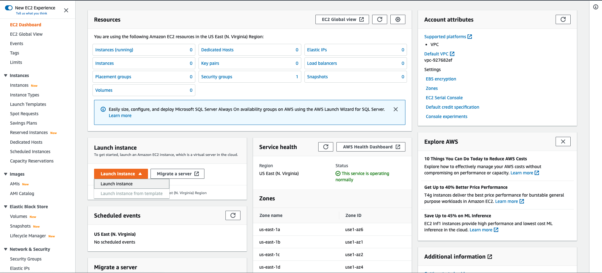
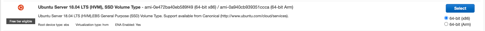
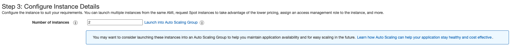
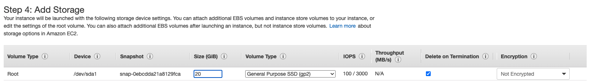
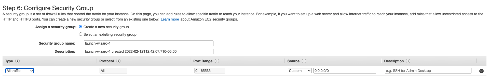

## Course info

### Learning Objectives

- History and evolution of k8s
- High level architecture and components
- The API, the most important resources, and how to use it
- Deploying and managing applications
- Upcoming features

### Course Requirements

The course is aimed at Linux administrators or software developers working with containers and trying to manage them in production. A good understanding of Linux, the command line, package managers, and `git`/Github are essential to get the most of the course. Access to a Linux server, desktop, VM, or cloud provider is needed for the labs.  The course is distro/cloud provider agnostic.

The Linux Foundations Guide to running the course on AWS free tier can be found [here](https://training.linuxfoundation.org/cm/prep/aws.pdf)

### Setting up labs on AWS

Log in or create an account for AWS.  Go to the EC2 dashboard and launch a new instance.

For the labs we want an Ubuntu 18.04 instance

For the course we need two nodes with 2 vCPU and 8 GiB memory.  Here are all the EC2 instances that meet these requirements. Here is the pricing for instances (US-East - N. Virginia) that meet this requirement as of Feb 2022.

| Instance name | On-Demand hourly rate | Storage          | Network performance |
| ------------- | --------------------- | ---------------- | ------------------- |
| t2.medium     | $0.0464               | EBS Only         | Low to Moderate     |
| t4g.large     | $0.0672               | EBS Only         | Up to 5 Gigabit     |
| t3a.large     | $0.0752               | EBS Only         | Up to 5 Gigabit     |
| c6gd.large    | $0.0768               | 1 x 118 NVMe SSD | Up to 10 Gigabit    |
| m6g.large     | $0.077                | EBS Only         | Up to 10 Gigabit    |
| t3.large      | $0.0832               | EBS Only         | Up to 5 Gigabit     |
| m5a.large     | $0.086                | EBS Only         | Up to 10 Gigabit    |
| c5ad.large    | $0.086                | 1 x 75 NVMe SSD  | Up to 10 Gigabit    |
| m6a.large     | $0.0864               | EBS Only         | Up to 12500 Megabit |
| m6gd.large    | $0.0904               | 1 x 118 NVMe SSD | Up to 10 Gigabit    |
| t2.large      | $0.0928               | EBS Only         | Low to Moderate     |
| m6i.large     | $0.096                | EBS Only         | Up to 12500 Megabit |
| m5.large*     | $0.096                | EBS Only         | Up to 10 Gigabit    |
| m4.large      | $0.10                 | EBS Only         | Moderate            |
| m5ad.large    | $0.103                | 1 x 75 NVMe SSD  | Up to 10 Gigabit    |
| c5n.large     | $0.108                | EBS Only         | Up to 25 Gigabit    |
| m5d.large     | $0.113                | 1 x 75 NVMe SSD  | Up to 10 Gigabit    |
| m5n.large     | $0.119                | EBS Only         | Up to 25 Gigabit    |
| m5dn.large    | $0.136                | 1 x 75 NVMe SSD  | Up to 25 Gigabit    |
| m5zn.large    | $0.1652               | EBS Only         | Up to 25 Gigabit    |
| im4gn.large   | $0.1819               | 1 x 937 SSD      | Up to 25 Gigabit    |

:::note
*This is the instance chose by the instructor in the course demo. Chosen for the better networking performance.

What sort of network performance do we need? Will a `t2.medium` or a `t3a.large` be sufficient? Running that for 8 hr/day with 20 GB storage will run ~$37/person if each person runs a master and worker node for themselves.
:::

Configure this for 2 instances, the defaults for the other settings should be good for now.

Configure the storage and change the size to 20 GiB.  Also make sure the __Delete on Termination__ box is checked so any storage is deleted with thr termination of the instance.

You can then add tags to the instances if you choose to.

Next configure the security. Change the __Type__ from _SSH_ to _All traffic_.

Finally review the instance an launch.  On launch it will ask you to add a key pair.  Here you can add an existing key pair or create a new one.  Once the instances launch, test connection with SSH.

## Lab 1.1 - Configuring system for `sudo`

Since I'm running Ubuntu no need to do this lab since sudo is already set up.  If it were not, here would be the procedure:

Launch a root shell with the `su` command and enter the `root` user password. 

In more recent distros, navigate to the `etc/sudoers.d` subdirectory and create a new file with the user you want to provide `sudo` access to as the file name. For example, if the user was named `andrew` create a file named `andrew` in `etc/sudoers.d`. Naming the file after the user is convention, but it is not strictly necessary.

In the file created, add `<username> ALL=(ALL) ALL`. Going back to out example user, `andrew`, the file should contain `andrew ALL=(ALL) ALL`.  A good explanation of what this means can be found on [this](https://unix.stackexchange.com/a/201866) StackExchange answer.

Finally, you may need to set the permissions on the file. Do this with `sudo chmod 440 /etc/sudoers.d/andrew`.  Note that some distros will require `400` instead of `440`.

There is one last step, even when the system is pre-configured for `sudo`.  Most distros set different paths for finding executables for normals users vs the `root` user. In particular the `/sbin` and `usr/sbin` paths are not searched, since `sudo` inherits `PATH` from the user, not the `root` user.  Because of this, at least for this course, it is recommended to update the `PATH` with `PATH=$PATH:/usr/sbin:/sbin` in the `.bashrc` file.

:::note
For my AWS instances the `PATH` already contained `/usr/sbin` and `/sbin` so no need to update the `.bashrc`.
:::

## Before You Begin

### Course Support

The course forum can be found [here](https://forum.linuxfoundation.org/categories/lfs258-class-forum).  This is a community resource to discuss topic of the course with other enrolled students.

### Course Timing

The course is accessible for 12 months from the date of enrollment. The chapters in the course are designed to build on previous ones, so it is best to go through the course in order.

### Labs and Assessments

Labs and assessment questions in the course are not graded. In live courses, the Linux Foundation strives for a 50/50 split of lecture and discussion to working on labs.  Take this into account since this is self-paced.
