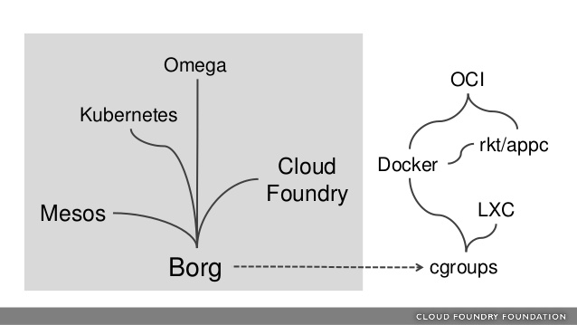

## Cource Reading

### Learning objectives

- Basic terminology
- Configuration tools
- Community resources

### What is Kubernetes

Running a single container is easy, but when trying to connect multiple containers with networking, scaling them, and deploying changes without downtime, it becomes a more difficult problem.  Kubernetes is a system to automate the deployment, scaling, and management of containerized applications. 

The name is derived from the Greek __κυβερνητης__, which means helmsman or ship pilot.  Kubernetes is often refered to as K8s, with the 8 representing the 8 letters between _k_ and _s_.

### Components of Kubernetes

Instead of deploying your application monolithically on a web server that potentially needs to ever grow to handle load, Kubernetes uses many small servers (microservices).  Because K8s is architected around microservices, server and client side applications expect there are many agents that could respond to a request and that each agent is transient, being destroyed and replaced as needed.  

Because of the transient nature, this allows different parts of the application to be decoupled.  Communication between services is API call-driven.  The configuration of the cluster is stored as JSON inside etcd, however most is the community write it as YAML, where K8s then converts it to JSON before storing it.

Kubernetes is written in Golang (unsurprising since it is an open source project originating from Google).

### Challenges

As mentioned previously, containers make it easy to package, ship, and run an application.  Docker especially has vastly improved the developer experience in these regards.

However, there are many challenges that appear when running and maintaining containers at scale.  To help with the maintainence, it is good practice to implement a continuous integration/continuous delivery (CI/CD) pipeline to make build, test and verify changes to continaers. Some common tools for CI/CD include:
- [Spinnaker](https://spinnaker.io/)
- [Jenkins](https://www.jenkins.io/)
- [Helm](https://helm.sh/)

There are many requirements when trying to run containers at scale.  First of all you need base infrastructure to run the containers. On top of that you need a way to launch the containers, replace them on failure, tear them down when no longer needed, and be able to rollout or rollback updates easily.  On top of that, all these actions need networking and storage that is just as flexible, scalable, and easy-to-use.  

Kubernetes solves all these problems, however the biggest problem is usually the application architecture itself.  The application needs to truly be architected to be transient. Something to ponder: if _any_ container were to be terminated, would that impact your application?

### Other solutions

- [Docker Swarm](https://docs.docker.com/engine/swarm/) - created by Docker Inc. Built right into the Docker engine
- [Apache Mesos](https://mesos.apache.org/) - is a powerful scheduler.  Orchestrates containers with a framework called [Marathon](https://mesosphere.github.io/marathon/)
- [Nomad](https://www.nomadproject.io/) - developed by HashiCorp. Nomad schedules tasks and has a Docker driver which allows for containers to be scheduled as a task.
- [Rancher](https://rancher.com/) - orchestrator agnostic system to manage applications. Works on top of Mesos, Swarm, and Kubernetes.

### Borg Heritage

One of the primary factors that distinguish Kubernetes from some of the other systems mentioned is the heritage of the project.  K8s was born out of Borg, Google's internal system to manage its applications.

This is partially what makes K8s a safe choice, as it was born from 15 years of internal development at Google to handle their data center workloads.  More notes on the ideas that inspired Kubernetes can be found [here](../misc/borg).

Borg has inspired many data center orchestration systems.  Google contributed `cgroups` to the Linux kernel in 2007, which along with Linux namespaces, form the heart of containerization today.  Mesos was inspired by discussions with Google.

The Cloud Foundry Foundation embraces the [12 factor application principles](https://12factor.net/) which Kuberentes and Borg adhere to well.

### Kubernetes architecture

Kubernetes is made of control plane (aka __cp__) nodes and worker nodes (formerly called minions). It is possible to run everything on one node for testing purposes.  The cp nodes are in charge of the following:
- API server
- scheduler
- various controllers
- storage system (contains cluster state, container settings, network config)

The Kubernetes API is exposed via the API server.  `kubectl` is the most common way to interact with the API but users can develop their own clients using `curl` commands.

The kube-scheduler recieves the pod spec for containers and finds the best node to them.  Each node has two processes, a kubelet and the kube-proxy.  The kubelet is NOT the container itself, but often a `systemd` process.  The kubelet is responsible for taking requests to run containers, managing the nodes resources. The kubelet also works with the container engine (e.g. containerd, Docker, cri-o) to run the containers.

The kube-proxy manages all the networking rules to expose the containers either to other containers or to external traffic.

One implication of API based communication means worker nodes can run on other platforms, however the cp must run on a Linux system.

### Terminology

A __pod__ is the smallest deployable unit in Kubernetes.  A pod is one or more containers that share an IP address, storage, and namespace.  Pods can be just one container, or  multiple. When multiple, typically one container is running the application while the others support the primary.  By allowing multiple containers in a pod, this allows for tightly couple groups on containers to be deployed as a unit, making it more efficient for them to communicate and share data.  This also allows for keeping with good development practices of only allowing one process per container, rather than having to bundle all the functionality of the containers running in a pod into a single container.

Kubernetes uses __namespaces__ to partition objects for resourcing and multi-tenancy.  Some objects will be scoped to the cluster, while others will only be scoped to one at a time.  Since namespaces segregate resources, pods would need to leverage services to communicate with one another.

Controller or __operators__ manage the orchestration of the pods through watch-loops.  The __kube-apiserver__ is interrogated by each operator for object states and modify the objects until the declared state from the API matches the current state of the object.  The operators are compiled within the __kube-controller-manager__ and others can be added through custom resource definitions.  The default operator for a container is a __Deployment__.  The Deployment manages ReplicaSets not the pods directly.  A __ReplicaSet__ is another operator which creates and terminates pods according to the podSpec.  The kubelet reads the podSpec and works with the container engine to download any resources then create or terminate containers until the status defined by the podSpec is met.

Service operator will request IP information from the endpoint operator, and then manages network connectivity based on labels on pods.  A service is used for establishing communication between pods, namespaces, and external sources.  __Jobs__ and __CronJobs__ handle single or repeated tasks.  There are other default operators as well.

To make management of pods easier (especially when scaling to thousands of pods across hundreds of nodes), __labels__ are used.  Labels are just strings included in metadata which can be used for checking or changing state so needing to know individual names or UIDs isn't necessary.  Nodes can have __taints__ to discourage pod assignments, unless the pod metadata contains __toleration__ (more on those topcs [here](https://kubernetes.io/docs/concepts/scheduling-eviction/taint-and-toleration/)).

Metadata also can contain __annotations__ which are part of the object but are not used as a selector like labels.  The info in the annotations can be used by a variety of sources, like the container, by third-parties, or other tools.

### Innovation

Kubernetes is a fast moving open source project.

- Open sourced in 2014
- 3 month release cycle for major releases
- Minor released every 10 days
- 100k+ commits from thousands of contributors

### User Community

Kubernetes has been quickly adopted. They list some good [case studies](https://kubernetes.io/case-studies/) on their site.

### Tools

There are many tools for getting up and running and interacting with Kubernetes.  One of the simplest is [__Minikube__](https://minikube.sigs.k8s.io/docs/) if you want to get started as easily as possible.  The labs in this course will focus in using `kubectl` and `kubeadm`, which are much more complex and powerful.  Later labs will also focus on using `helm` which acts as a package manager for Kubernetes.  These tools develop just as fast as Kubernetes itself!

### Cloud Native Computing Foundation

Google donated Kubernetes to a newly formed Cloud Native Computing Foundation to open source and steward the project. CNCF has grown to govern other [open source projects](https://www.cncf.io/projects/) in the cloud native space.

## Lab 2.1 - View Online Resources

Official documentation and other resources can be found at [kubernetes.io](https://kubernetes.io/).

Issues with Kubernetes are tracked in the [project Github repo](https://github.com/kubernetes/kubernetes/issues).

## Knowledge check

_One or multiple containers_, _shared IP address_, and a _single namespace_ are all part of a Pod.

_Google_ developed Borg as an internal project (the precursor to Kubernetes).

Object and state of the cluster are stored in the _etcd_ database.

Orchestration is managed through a series of watch-loops or controllers. Each interrogates the _kube-apiserver_ for a particular object state.
