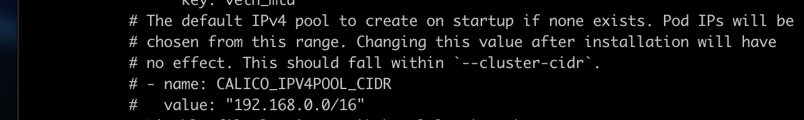
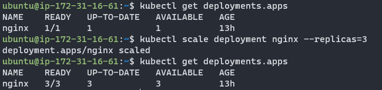

## Course Reading

### Learning objectives

- Download installation and configuration tools
- Install a Kubernetes master and grow cluster
- Configure network for secure communication
- High-availability deployment considerations


### Installation tools

There are many ways to get up an running with Kubernetes.

If you want to get started without needing to install and configure the cluster yourself, a managed cloud provider solution is a good option.  Google offers [Google Kubernetes Engine](https://cloud.google.com/kubernetes-engine) (GKE) and AWS offers [Elastic Kubernetes Service](https://aws.amazon.com/eks/) (EKS) which gives users more control of cp nodes.

Another simple way to get up and running is with [Minikube](https://minikube.sigs.k8s.io/docs/) which is a single binary that runs in a VirtualBox VM.  This is a great tool to use as a learning and testing environment even though it is just a single node.

Canonical has also developed a tool called [MicroK8s](https://microk8s.io/docs) which aims to make installation easy.  This is great for running Kubernetes at the edge or on IoT devices. Runs on Ubuntu 16.04 and later.

This course focuses on using `kubeadm` which is the suggested community tool by the Kubernetes project for setting up a cluster.  Getting the cluster set up with `kubeadm` only requires two commands, `kubeadm init` on the cp node and `kubeadm join` on any worker nodes or additional cp nodes, and the cluster bootstraps itself.

To actually use the cluster the `kubectl` command is used.  This run locally on your machine and communicated with the cluster API endpoint.  `kubectl` can control all Kubernetes resources to create, manage, and delete.

There are also other mechanisms to create a Kubernetes cluster, like [kubespray](https://github.com/kubernetes-sigs/kubespray) and [kops](https://github.com/kubernetes/kops).


### Installing `kubectl`

The recommended way to configure and manage your Kubernetes cluster is `kubectl`.  Most distros have `kubectl` available in their repositories, or you can download the code from [Github](https://github.com/kubernetes/kubernetes/tree/master/pkg/kubectl) and compile and install from the source code.

The command stores its configuration in `$HOME/.kube/config`, which contains information for all the K8s endpoints you might use.  In it are cluster definitions (IP endpoints), credentials, and contexts.  The contexts is a combination of cluster and user credentials, which can be passed in the command line or the context can be switched with 

```bash
kubectl config use-context foobar
```

which is helpful for switching between local environments to a cluster in the cloud.


### Using Google Kubernetes Engine (GKE)

Requirements:
- A Google Cloud account
- Payment method for any services used
- `gcloud` command line client.

Instructions for installing `gcloud` can be found [here](https://cloud.google.com/sdk/docs/install#linux).

The GKE quick start guide can be found [here](https://cloud.google.com/kubernetes-engine/docs/quickstart).

Then to create your first cluster in GKE:

```bash
gcloud container clusters create linuxfoundation

gcloud container clusters list

kubectl get nodes
```

The first command creates the cluster with the name _linuxfoundation_.  The next command lists the cluster. The final command lists the nodes of the cluster. Installing `gcloud` automatically installs `kubectl` as well.

Once done with the cluster, __delete it or you will be charged__.

```bash
gcloud container clusters delete linuxfoundation
```


### Using minikube

Minikube is a project under the [Kubernetes organization on Github](https://github.com/kubernetes/minikube).

To download and install the latest version of minikube run

```bash
curl -Lo minikube https://storage.googleapis.com/minikube/releases/latest/minikube-darwin-amd64

chmod +x minikube

sudo mv minikube /usr/local/bin
```

Once minikube is installed, the Kubernetes can be started with

```bash
minikube start

kubectl get nodes
```

The first command will start a VirtualBox VM running a single node Kubernetes deployment and the Docker engine.  Internally, minikube is running a single Golang binary, `localkube`, which runs all the components on Kubernetes together, which makes minikube much simpler than a full Kubernetes deployment.


### Installing with `kubeadm`

Currently, the most straightforward method of building a full Kubernetes cluster is `kubeadm` which was first introduced in v1.4.0 and moved from beta to stable with added functionality for high availability in v1.15.0.

Official documentation for setting up a cluster with `kubeadm` can be found [here](https://kubernetes.io/docs/setup/production-environment/tools/kubeadm/create-cluster-kubeadm/).

To setup a cluster:
- Run `kubeadm init` on head node
- Create network for IP-per-Pod criteria
- Run `kubeadm join` on workers or secondary cp nodes.

Joining other nodes to the cluster will require at least a token and a SHA256 hash, which is returned by the `kubeadm init`. `kubectl` can also be used to create the network using a resource manifest.

An example, using the Weave network:

```bash
kubectl create -f https://git.io/weave-kube
```

Once the steps are complete and the workers and secondary cp nodes have joined, there will be an operational multi-node Kubernetes cluster and you can interact with it using `kubectl`.


### `kubeadm-upgrade`

Building the cluster with `kubeadm` gives the option to upgrade using `kubeadm upgrade`.  Most users will try to stay on the same version for as long as possible, but this tool allows a path for regular upgrades for security.

Some of the command for `kubeadm upgrade`:

- `plan` checks the installed version against the newest version to verify upgradeability
- `apply` upgrades the first cp node to the version specified
- `diff` shows the differences applied in an upgrade. It is similar to `apply --dry-run`.
- `node` lets local kubelet configuration to be updated on the worker nodes, or secondary cp nodes. Also calls a `phase` command to step through upgrading.

In general, the process for upgrading is:
- Update software
- Check version
- Drain cp
- View planned upgrade
- Apply upgrade
- Uncordon the cp and allow pods to be scheduled

More in-depth documentation about the upgrade process can be found in the [official documentation here](https://kubernetes.io/docs/tasks/administer-cluster/kubeadm/kubeadm-upgrade/).


### Installing a Pod network

Prior to initialization of a cluster, a network needs to be considered and IP conflicts avoided.  There are many options for Pod networking. Many projects mention Container Network Interface (or CNI, another CNCF project) as a way to handle deployments and cleaning up network resources.

#### Calico

A flat layer 3 network that communicates without IP encapsulation. It is used in production with many orchestration tools.  It has a simple and flexible networking model and scales well to large environments.  Canal is another option, that is part of the same project, which can integrate with Flannel.  Calico also allows implementing network policies.  

[Project webpage](https://www.tigera.io/project-calico/)


#### Flannel

A layer 3 IPv4 network between cluster nodes. It has a long history with Kubernetes as it as developed by CoreOS.  Flannel focuses on traffic between hosts, not the local container configuration for networking. `flanneld` agents sit on each node to allocate subnet leases to the host.  It can be configured after deployment but it is easier before Pods are added.

[Project Github](https://github.com/flannel-io/flannel)


#### Kube-Router

A single binary that "_does it all_".  It is in alpha but promises distributed load balancer, firewall, and router purpose built for K8s.

[Project webpage](https://www.kube-router.io/)


#### Romana

This project is aimed towards automating network and security in cloud native applications.  Romana is aimed at large clusters, IPAM-aware topology and integrates with kops clusters.

[Project Github](https://github.com/romana/romana)


#### Weave Net

Usually used as an add-on for CNI enabled clusters.

[Project webpage](https://www.weave.works/oss/net/)


### More installation tools

Kubernetes is like any other application you would install on a server so the the usual configuration management tools (Terraform, Ansible, Chef, Puppet, etc.) can be used for installation.

The best way to learn about installing Kubernetes manually is with Kelsey Hightower's [Kubernetes the Hard Way](../hard-way/about).

#### kubespray

kubespray is a Kubernetes incubator project. It is an advanced ansible playbook that can set up a cluster on different OSes with different network providers.  It was formerly known as kargo.

[Project Github](https://github.com/kubernetes-sigs/kubespray)


#### kops

kops (short for Kubernetes Operations) allows for single command line creation of K8s cluster on AWS.  Creation on GKE is in beta and VMWare is in alpha.

[Project Github](https://github.com/kubernetes/kops)


#### kube-aws

A command line tool for creating Kubernetes clusters on AWS using CloudFormation.  This tool has been retired and has reached end of life.

[Project Github](https://github.com/kubernetes-retired/kube-aws)


#### kubicorn

kubicorn leverages kubeadm to build clusters.  It has no DNS dependency, runs on multiple OSes, and uses snapshots to capture clusters and move them.

[Project Github](http://kubicorn.io/)


### Installation considerations

Before installing a full cluster, it is good to experiment with a single node cluster, like the one minikube provides.

Once ready to deploy a cluster of servers there are a some decision points
- What provider? Public or private cloud? Virtual or physical servers?
- What operating system? Kubernetes runs on most Linux distros.
- What networking solution? Is an overlay needed?
- High availability for the head nodes?

To choose the best option, the Kubernetes [_Getting Started_](https://kubernetes.io/docs/setup/) docs are a good resource.

In most cases the Kubernetes components will run as `systemd` unit files as that has become the dominant init system for Linux OSes.  They could also be run by a kubelet on the head node (kubeadm).


### Main deployment configurations

There are four main deployment configurations.

- __Single node__ - all components run on the same server, Good for testing and development, not well suited for production.
- __Single head node, multiple workers__ - Typically has an etcd instance running on the head node with the API, scheduler, and controller-manager.
- __Multiple head nodes with HA, multiple workers__ - This type of configuration adds more durability to the cluster. The API server is fronted by a load balancer, scheduler and controller-manager elect a leader (configured by flags). etcd can still run as a single node.
- __HA etcd, HA head nodes, multiple workers__ - This is the most advanced and robust Kubernetes setup.  etcd would also run as a true cluster on nodes separate from th head nodes.

A tool called Kubernetes Federation also offers high availability.  It joins multiple clusters together with a common cp to let resources move between clusters administratively or due to failure.  It has some issues but there is hope [v2](https://github.com/kubernetes-sigs/kubefed) will be a better product.


### `systemd` unit file for Kubernetes

In any of the mentioned configurations, some components will run as standard system daemons. Here is an example of a (by no means perfect) `systemd` unit file for the controller-manager:

```yaml
- name: kube-controller-manager.service
    command: start 
    content: |
      [Unit]
      Description=Kubernetes Controller Manager Documentation=https://github.com/kubernetes/...
      Requires=kube-apiserver.service
      After=kube-apiserver.service
      [Service]
      ExecStartPre=/usr/bin/curl -L -o /opt/bin/kube-controller-manager -z /opt/bin/kube-controller-manager https://storage.googleapis.com...
      ExecStartPre=/usr/bin/chmod +x /opt/bin/kube-controller-manager
      ExecStart=/opt/bin/kube-controller-manager \
        --service-account-private-key-file=/opt/bin/kube-serviceaccount.key \
        --root-ca-file=/var/run/kubernetes/apiserver.crt \
        --cp=127.0.0.1:8080 \
...
```

Familiarity with the configuration of each components and the options available come with more practice.  Expect the option to change as Kubernetes continues to rapidly develop.

An example, the API serve is a highly configurable component. Here's the [documentation for configuring](https://kubernetes.io/docs/reference/command-line-tools-reference/kube-apiserver/) it.


### Using Hyperkube

Instead of system deamons, the API server, scheduler, and controller-manager can be run as containers.  This is how `kubeadm` runs them. Similar to minikube, hyperkube runs as an all in one binary [which Google hosts](https://console.cloud.google.com/gcr/images/google-containers/GLOBAL/hyperkube) as a container (this may require adding a new repository so Docker can find and download the image).

Using hyperkube runs a kubelet as a system daemon and then reads manifests for instructions on how to run the other components.  Running hyperkube is also a good way to begin learning the different configuration flags of the components that form the cp.  You can get more information on these flags by downloading the image and running the help commands:

```bash
docker run --rm gcr.io/google_containers/hyperkube:v1.16.7 /hyperkube kube-apiserver --help

docker run --rm gcr.io/google_containers/hyperkube:v1.16.7 /hyperkube kube-scheduler --help

docker run --rm gcr.io/google_containers/hyperkube:v1.16.7 /hyperkube kube-controller-manager --help
```


### Compiling from source

Apart from these useful tool, Kubernetes can also be compiled from source by cloning the repository and building the binaries.  Building can be done natively with Golang or via Docker containers.

To build via Golang, first [install it](https://go.dev/doc/install). Then clone the [`kubernetes` repo](https://github.com/kubernetes/kubernetes) and run the `make` command:

```bash
cd $GOPATH
git clone https://github.com/kubernetes/kubernetes
cd kubernetes
make
```

For building with Docker, instead of `make` run `make quick-release`.

The built binaries will be in the `__output/bin` directory.


## Lab Exercises

### Lab 3.1 - Install Kubernetes

1. SSH into master node

```bash
ssh -i <PEM key name> <user>@<IP address>
```

2. `wget` the course materials.

:::important
Check the [course material page](https://training.linuxfoundation.org/cm/LFS258/) before running to make sure you are downloading the latest tarball
:::

```bash
wget https://training.linuxfoundation.org/cm/LFS258/LFS258_V2021-09-20_SOLUTIONS.tar.xz \
    --user=LFtraining --password=Penguin2014

tar -xvf LFS258_V2021-09-20_SOLUTIONS.tar.xz
```

3. Become root and update/upgrade the system.

```bash
sudo -i

apt-get update && apt-get upgrade -y
```

The `-y` flag will accept all prompt to make the upgrade go faster so you are not prompted for every package upgrade.

4. Install an editor, `nano`, `vim`, and `emacs` all work well.  The labs are designed to use `vim`

```bash
apt-get install -y vim
```

5. Install container runtime.  The course suggests Docker, as that is the default runtime when building with `kubeadm` on Ubuntu at the moment.  For an added challenge (maybe try these labs again with this option?) you could use cri-o, but at the moment that takes multiple steps.

```bash
apt-get install -y docker.io
```

6. Add a new repo for Kubernetes. Create the file and add an entry for the main repo for the distro we are using (Ubuntu in my case).  Even though we are using Ubuntu 18.04, we'll use the `kubernetes-xenial` repo. Also include the keyword `main`  Note there are four sections to the entry.

Creating the file:

```bash
vim /etc/apt/sources.list.d/kubernetes.list
```

The entry should look like:

```bash
deb http://apt.kubernetes.io/ kubernetes-xenial main
```

7. Add a GPG key for the packages

```bash
curl -s https://packages.cloud.google.com/apt/doc/apt-key.gpg | apt-key add -
```

8. Update the system again, with the new repo declared to download the latest repo information.

```bash
apt-get update
```

9. Install the software.  New versions release regularly but there are often bugs. To use the latest, omit the `=<version>` from the following commands. Because of this we will install the most recent stable versions. In a later lab, the cluster will be upgraded to a newer version.

```bash
apt-get install -y kubeadm=1.21.1-00 kubelet=1.21.1-00 kubectl=1.21.1-00

apt-mark hold kubelet kubeadm kubectl
```

10. Decide on a pod network.  As discussed previously, this should take into account the anticipated demands on the cluster.  There can only be one pod network per cluster, although there is a project, CNI-genie that is trying to change that.

The network needs to allow container-to-container, pod-to-pod, pod-to-service, and external-to-service communication. Docker uses host-private networking (`docker0` virtual bridge and `veth` interfaces) which requires being on the host to communicate.

For this we will use Calico as the network plugin to use _Network Policies_ later in the course. Calico does not deploy using the CNI by default at the moment. Once downloaded, we need to look for the expected IPv4 range the containers will use in the configuration file.

```bash
wget https://docs.projectcalico.org/manifests/calico.yaml
```

11.  With the manifest downloaded, look through it for the IPv4 pool assigned to the containers (the `less` or `cat` commands are good for this).  Also take a moment while paging through to look at some of the other settings. The `CALICO_IPV4POOL_CIDR` must match the pool given to `kubeadm init`.

```bash
cat calico.yaml
```



12. Find the IP address for the primary interface of the cp server.  There are two ways to do this:

```bash
hostname -i
```

or 

```bash
ip addr show
```

13. Add a local DNS alias for the cp server by editing the /etc/hosts file and adding an entry for the IP we found in the last step with the alias `k8scp`.

```bash
vim /etc/hosts
```

14. Create a configuration file for the cluster. For Docker, we need to configure the cp endpoint, software version, and podSubnet values.  For cri-o there are many more things needed in the configuration.

```bash
vim kubeadm-config.yaml
```

In the config file should be this:

```yaml
apiVersion: kubeadm.k8s.io/v1beta2
kind: ClusterConfiguration
kubernetesVersion: 1.21.1           #<-- Use the word stable for newest version
controlPlaneEndpoint: "k8scp:6443"  #<-- Use the node alias not the IP
networking:
  podSubnet: 192.168.0.0/16         #<-- Match the IP range from the Calico config file
```

15. Initialize the cp. This output is likely to change as the software continues to mature. It will also give you a token to use to join worker nodes later, this can be retrieved again using `kubeadm token list`.  You will also be asked to configure a pod network, and the Calico configuration file will be passed for this.

```bash
kubeadm init --config=kubeadm-config.yaml --upload-certs | tee kubeadm-init.out
```

Once the cp is initialize, there are commands to run not as root. To exit as the root user run

```bash
exit
```

Then run the following commands:

```bash
mkdir -p $HOME/.kube

sudo cp -i /etc/kubernetes/admin.conf $HOME/.kube/config

sudo chown $(id -u):$(id -g) $HOME/.kube/config

less .kube/config
```

17. Apply the network plugin

```bash
sudo cp /root/calico.yaml .

kubectl apply -f calico.yaml
```

18. We'll next install the autocompletion to make working with `kubectl` a little easier.

```bash
sudo apt-get install bash-completion -y
```

Then restart the terminal session and do the following:

```bash
source <(kubectl completion bash)

echo "source <(kubectl completion bash)" >> $HOME/.bashrc
```

19. Test the autocomplete installation worked using tab as you type to autocomplete the command.

20. View the config values that we could have used in the `kubeadm-config.yaml`.

```bash
sudo kubeadm config print init-defaults
```


### Lab 3.2 - Grow the cluster

1. SSH into the worker node and use the same process as the cp node to get all the software installed on the worker node. This is steps 1 and 3-9 in the [previous section](#lab-31---install-kubernetes).

2. Find your IP address for the __cp node__.  Reminder that you can do this again with `hostname -i`.

3. Next we want to join the cp node and the worker.  Remember that the join command is printed in the console but this command only works for 2 hours until it expires, so in the future we will need to generate our own.  To do this:

```bash
sudo kubeadm token create
```

And then to list the token run:

```bash
sudo kubeadm token list
```

4. Create a Discovery Token CA Cert Hash on the __cp__ to make sure there is a secure connection between it and the worker node.

```bash
openssl x509 -pubkey \
    -in /etc/kubernetes/pki/ca.crt | openssl rsa \
    -pubin -outform der 2>/dev/null | openssl dgst \
    -sha256 -hex | sed's/ˆ.* //'
```

5. On the __worker__ node add a hostname alias for the __cp__ name like we did originally on the cp node in the previous lab, with the alias `k8scp`.

```bash
vim /etc/hosts
```

6. Next we can join the __worker__/__second__ node to the __cp__.  We will use the token and the hash (a `sha256`) to join them.  The `kube init` would have an example of this to use if within 2 hours of running the command. Otherwise, we would build the command from the token and hash we just created. We'll also use the hostname alias we setup and port `6443`.

```bash
kubeadm join \
    --token <token> \
    k8scp:6443 \
    --discovery-token-ca-cert-hash sha256:<hash>
```

You can check this worked by running 

```bash
kubectl get nodes
```

on the __cp__ node.  

7. Now exit root on the __worker__ node and try to run kubectl to get the nodes. It should fail because there is no local configuration to access the cluster.

```bash
exit
kubectl get nodes
ls -l .kube
```

The second like should fail due to the lack of configuration and the 3rd should fail due to the file not existing.


### Lab 3.3 - Finish cluster setup

1. View available nodes of the cluster.  On the __cp__ node run

```bash
kubectl get nodes
```

2. Look at the details on the __cp__ node. Notice that `Taints`. The cp does not run non-infrastructure pods by default for security and resource contention.

```bash
kubectl describe node k8scp
```

3. Enable non-infrastructure pods to run. For training we allow usage of the node but this can be skipped when setting up for a production environment.

```bash
kubectl describe node | grep -i taint

kubectl taint nodes --all node-role.kubernetes.io/master-
```

4. Determine if the DNS and Calico pods are ready for use.

```bash
kubectl get pods --all-namespaces
```

If the CoreDNS pods seem to be getting stuck you may need to delete them to force them to be recreated.

```bash
kubectl -n kube-system delete coredns-<instance> coredns-<instance>
```

5. Once this finishes, run 

```bash
ip a
```

and you should see a new tunnel interface, `tunl0`, and more new interfaces as other pods are deployed.


### Lab 3.4 - Deploy a simple application

1. Create a new `deployment`, which deploys a new container running an application and verify it is running.

```bash
kubectl create deployment nginx --image=nginx
kubectl get deployments
```

2. View the details of the deployment

```bash
kubectl describe deployment nginx
```

3. View the basic steps the cluster made to create the deployment

```bash
kubectl get events
```

4. Get the description of the deployment in YAML format and notice, about halfway down in the output is the current status of the deployment.

```bash
kubectl get deployment nginx -o yaml
```

5. Run the command but pipe the output to a file. Then edit the file and remove `creationTimestamp`,`resourceVersion`, and `uid` sections. Also remove everything from `status` down.

```bash
kubectl get deployment nginx -o yaml > first.yaml

vim first.yaml
```

6. Delete the existing deployment

```bash
kubectl delete deployment nginx
```

7. Recreate the deployment, this time with our edited YAML file.

```bash
kubectl create -f first.yaml
```

8. Get the output of this deployment and compare it to the first.

```bash
kubectl get deployment nginx -o yaml > second.yaml

diff first.yaml second.yaml
```

9. Now we will learn some ways to get useful YAML and JSON output.  The first is by "creating" a deployment but use the `--dry-run` flag to just see the deployment spec. It should look very similar to the ones modified in previous steps.  Also verify that no deployment was actually created by getting the deployment and verifying only the original `nginx` deployment is there.

```bash
kubectl create deployment two --image=nginx --dry-run=client -o yaml
kubectl get deployment
```

We can also get the YAML for an existing deployment as seen in previous steps.

```bash
kubectl get deployments nginx -o yaml
```

We can also output to JSON.

```bash
kubectl get deployments nginx -o json
```

10. Now back to our `nginx` deployment.  To be able to talk to the web server from external points of the cluster we need to create a `service`.  First look at the help page for the `expose` command. Notice some of the examples in the help field.

```bash
kubectl expose -h
```

Try to gain access to the server but notice it will fail since a port was not given.

```bash
kubectl expose deployment/nginx
```

11. Now update the deployment container spec in the YAML file with the port information.

```bash
vim first.yaml
```

and add the following fields under the `spec.template.spec.containers` section of the file.

```yaml
ports:
- containerPort: 80
  protocol: TCP
```

There are a few subcommands that will update the configuration. `apply`, `edit`, and `path` all do it non-disruptively.

`apply` does a 3-way diff on the previous, current, and supplied input to determine what changes to make.  Fields that are not mentioned will not be touched.

`edit` gets the current configuration, opens an editor, and then runs an `apply` on the made changes.

`patch` can be used to update API objects in place.

For changes that cannot be made once te object is initialized, `replace` can be used which will destroy the object and recreate it.  For the `nginx` deployment we must do this.

```bash
kubectl replace -f first.yaml
```

Then check to make sure the deployment and pod status show that they are ready.

```bash
kubectl get deploy,pod
```

12. Now try to expose the web server again.

```bash
kubectl expose deployment/nginx
```

Then check the service and endpoint information.  Take note of the `ClusterIP` (provided by Calico) in the service information and the `Endpoint` in the endpoint information to use for later.

```bash
kubectl get svc nginx

kubectl get ep nginx
```

10.96.14.131
192.168.157.133:80

13. Determine which node the container is running on.  Log into that node and run a `tcpdump` (this may need to be installed) to see the traffic on `tunl0`.  While the `tcpdump` is still running use `curl` to send an HTTP request.

On the __cp node__:

```bash
kubectl describe pod nginx-<specific deployment> | grep Node:
```

On the node that is running the pod (in my case thw worker node):

```bash
sudo tcpdump -i tunl0
```

Now `curl` the `ClusterIP` on port `80` and also try to `curl` the `Endpoint`. You should get the same response.

```bash
curl <ClusterIP>:80
curl <Endpoint>
```

14. Now scale the deployment to three web servers.

```bash
kubectl get deployment

kubectl scale deployment nginx --replicas=3

kubectl get deployment nginx
```



14. Now look at the endpoints again. There should now be three.

```bash
kubectl get ep nginx
```

Now find the oldest deployment running and delete it so that it is recreated.

```bash
kubectl get pod -o wide
kubectl delete pod nginx-<specific deployment> 
```

Then confirm the new pod is running. You should see one that is newer than the other two.

```bash
kubectl get po
```

If you view the endpoints again you will notice the original IP is no longer in use. Try to `curl` the `ClusterIP` and any of the `Endpoints` again. You should still have access to the cluster.  Access is only available within the cluster though.  Once doe you can stop the `tcpdump` with `ctrl-C`.


### Lab 3.5 - Access from outside the cluster

Access to the cluster from external sources can be configured using Services with a DNS-addon or environment variables.  We'll use environment variables.

1. Gt this list of pods and then `exec` into on to print the environment variables with `printenv`.

```bash
kubectl get po

kubectl exec nginx-<specific deployment> -- printenv | grep KUBERNETES
```

2. Find the existing service for `nginx` and delete it.

```bash
kubectl get svc

kubectl delete svc nginx
```

3. Now create the service again, but this time as type `LoadBalancer`.

```bash
kubectl expose deployment nginx --type=LoadBalancer

kubectl get svc
```

Note the `EXTERNAL_IP` will be pending until a provider responds with a load balancer.

4. Now on your local machine, in the browser, type the public IP of the node and the port given for the service in the previous step.  You should get the nginx welcome page.

5. Now scale down the replicas to zero and confirm they are all down.

```bash
kubectl scale deployment nginx --replicas=0

kubectl get po
```

Access to the web server should fail now. Scale back up to two replicas and try again, the web server should be working.

6. Now delete the deployment to recover the system resources.  Note that the service and endpoints need to also be deleted.

```bash
kubectl delete deployments nginx

kubectl delete ep nginx

kubectl delete svc nginx
```


## Knowledge check

- `kubeadm` is used to __create a cluster and add nodes__
- The main binary for working with object of a Kubernetes cluster is __`kubectl`__
- There can be __1__ pod network per cluster
- The `~/.kube/config` file contains __endpoints__, __SSL keys__, and __contexts__.
