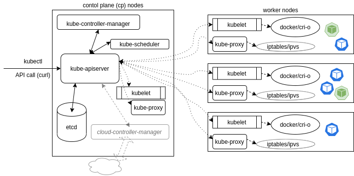

## Course Reading

### Learning objectives

- Discuss main components of a Kubernetes cluster
- Learn details about the master agent kube-apiserver
- Learn how etcd keeps the cluster state and configuration
- Study kubelet local agent
- Learn how controllers manage the cluster state
- Learn what a Pod is to the cluster
- Learn more about the network configuration of the cluster
- Discuss Kubernetes services

### Main components

- Control plane and worker nodes
- Operators
- Services
- Pods and containers
- Namespaces and quotas
- Network and policies
- Storage

A Kubernetes cluster is made of two main parts, the cp nodes and the worker nodes.  The cluster is controlled through API calls to operators, both intrnally and from external traffic.  Most of thr processes that occur in the cluster run in containers.

### Control plane node

The cp node are responsible for running the manager processes for the clsuter.  As Kubernetes continues to mature, more components are developed for dedicated handling of certain needs.  An example of this is the __cloud-controler-manager__ which handle interactions with tooling that sits on top of Kubernetes, but these processes were once part of the __kube-controller-mamager__.

It is common place to have add-ons for a production cluster that handle specific tasks, like DNS services or cluster-level logging and monitoring.

Conceptually, the cp is the various pods responsible for ensuring the current cluster state matches the desired state. For clusters build with `kubeadm`, kubelet processes are managed by systemd and once running it will start every pod found in `/etc/kubernetes/manifests/`.

#### kube-apiserver

The __kube-apiserver__ is responsible for all calls to the cluster (internal and external) and is central to the operation of the cluster.  It accepts and validates all action of the cluster, as well as validating and configuring all data for API objects, and handles all REST operations.  Thw kube-apiserver is also the only part of the clsuter that has connection with the __etcd__ database.

As of v1.18, there is a beta Konnectivity service that separtes user traffic from the internal server traffic. Until this feature was added, all traffic was not segregated which had performance, capacity, and security ramifications.

#### kube-scheduler

The __kube-scheduler__ is in charge of scheduling which nodes will host which Pods.  The scheduler will view available resources to bind, and will try and retry to deploy the Pods depnding on availability and success.

Custom schedulers can also be used to use a different algorithm than the default methodology.  There also several ways to affect how pods get applied with the default algorithm, such as taints and tolerations, as well as wth metadata labels

The code for the scheduler can be found [here](https://raw.githubusercontent.com/kubernetes/kubernetes/master/pkg/scheduler/scheduler.go) to view the specifics of what is going on under the hood.

#### etcd database

Cluster state, networking, and all other persistent information is all stored in an __etcd__ database (which is a b+tree key-value store).  Values are always appended to the end and previous copies of data are marked for removal by compaction processes.  It works with curl abd other HTTP libraries.

All requests to update values travel via the __kube-apiserver__, which then passes along the request to __etcd__.  For simultaneous requests, the first request would update the database and the second request would not have the same version number and the kube-apiserver would respond with a 409 error to the requester.  There is no further logic past the denail, so it is on the client to act upon a denial to push an update to the database.

etcd consists of a _Leader_ database with possible _followers_, or non-voting _Learners_ who are joining the cluster.  They have ongoing communication to determine which will be the Leader or to determine a new one in case of a failure.

etcd is very fast and has the potential for durability, although there are some hiccups with new tools (kubeadm included) and features (like upgrading the entire cluster).  While most Kubernetes objects are deisgned to be transient microservices, etcd is the exception and cannot be terminated without any concern like most others.  Because it is the persistent state of the cluster care must be taken to protect and secure it.  Before any upgrades or maintenance. etcd should be backed up.  The `etcdctl` command allows for this with `snapshot save` and `snapshot restore`.

#### Other agents

The __kube-controller-manager__ is a core control loop deamon, which along with the kube-apiserver, determines the state of the cluster.  When the state does not match, the kube-controller-manager contacts the controller responsible for getting the state to where it need to be.  There are several operators in use (endpoint, namespace, replication) and the list has grown as Kubernetes matures.

In beta since v1.11, the __cloud-controller-manager__, or __ccm__, interacts with agents outside the cluster.  It's processes where once managed by the kube-control-manager.  Splitting out these processes allows for faster changes without changing the core Kubernetes control process.  Each kubelet needs to use the `--cloud-provider-external` settings passed to the binary.  A custom ccm can also be developed and dployed as a daemonset as an in-tree or out-of-tree deployment.  It is an optional component and takes some steps to enable. You can learn about them [here](https://kubernetes.io/docs/tasks/administer-cluster/running-cloud-controller/).

Depending on the networking plugin, there could be varous pods to handle network traffic.  To handle all DNS queries, Kubernetes service discovery, and other function __CoreDNS__ server has replaced __kube-dns__.  The ability to use chained plugins allows for the server to be easily extensible.

### Worker nodes

All the nodes run the kubelet and kube-proxy as well as a container engine.  Other management daemons watch these agents or enhance functionality for services not yet included by Kubernetes.

The kubelet interacts with the container engine and makes sure the containers that should be running are.  The kube-proxy handles all the networking to the containers using iptable entries.  The kube-proxy also has a userspace mode to monitor Services and Endpoints using a random port to proxy any traffic using ipvs. Depnding on the network plugin chosen, you may also see pods for the plugin.

Each node could run in a different engine and it is likely that Kubernetes will support more container runtimes as it continues to mature.

While not part of a typicall installation, some users will user supervisord to monitor the kubelet and docker processes and restart them in they fail and log events.  Kuberentes does not yet have cluster-wide logging, and instead the CNCF project [Fluentd](https://www.fluentd.org/) is used, which when implement correctly, gives a logging layer for the cluster which can filter, buffer, and route messages.

Metric on a cluster-wide scale is another lacking area of Kubernetes.  There is a metrics-server SIG which gives basic functionality to collect CPU and memory utilization of a node or pod.  For more complete metrics, many use the [Prometheus](https://prometheus.io/) project.

### Kubelet

The kubelet systemd process accepts the API calls for Pod specification (known as a `PodSpec` which is a JOSN or YAML file that describes a pod) and works to configure the local node to meet the specification.  The kublet is also responsible for the following:

- Mounting volumes to Pod
- Downloading secrots
- Passing requests to local continaer engine
- Repoting Pod and node status to cluster

The kubelet also calls other components like the Topology Manager, whih uses _hints_ to conifigure topology-aware resource NUMA assignments for CPU and hardware acceleration. This is off by default as it is an alpha feature.

### Operators

