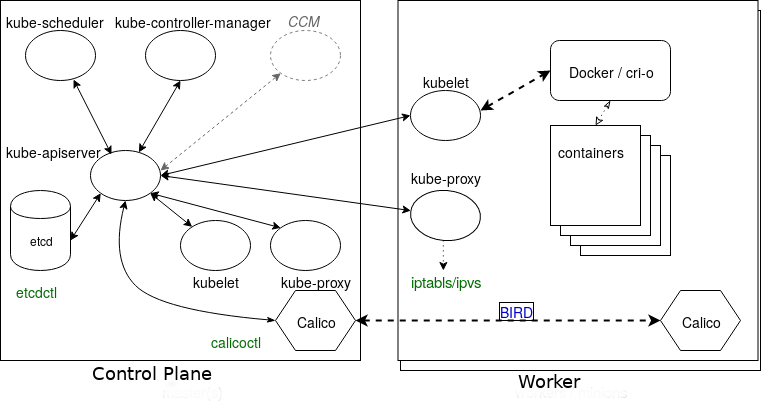
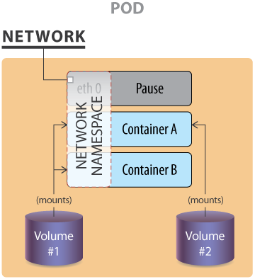
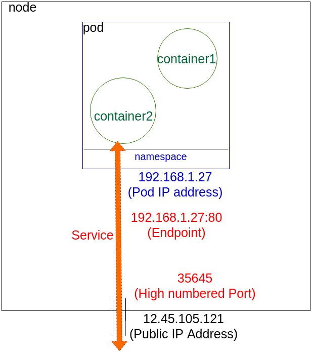
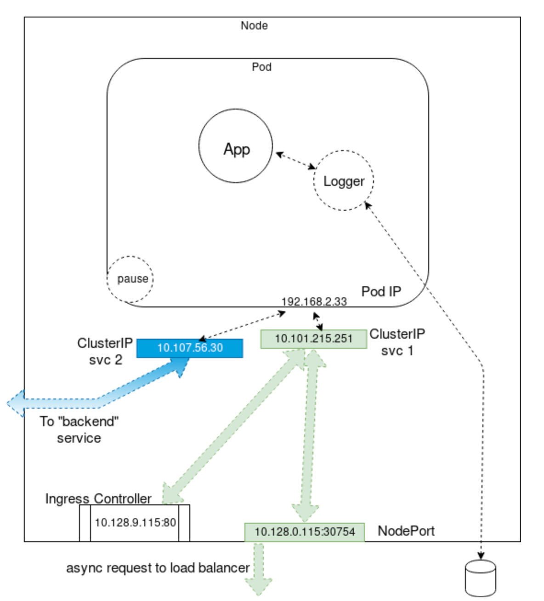

## Course Reading

### Learning objectives

- Discuss main components of a Kubernetes cluster
- Learn details about the master agent kube-apiserver
- Learn how etcd keeps the cluster state and configuration
- Study kubelet local agent
- Learn how controllers manage the cluster state
- Learn what a Pod is to the cluster
- Learn more about the network configuration of the cluster
- Discuss Kubernetes services


### Main components

- Control plane and worker nodes
- Operators
- Services
- Pods and containers
- Namespaces and quotas
- Network and policies
- Storage


A Kubernetes cluster is made of two main parts, the cp nodes and the worker nodes.  The cluster is controlled through API calls to operators, both intrnally and from external traffic.  Most of thr processes that occur in the cluster run in containers.


### Control plane node

The cp node are responsible for running the manager processes for the clsuter.  As Kubernetes continues to mature, more components are developed for dedicated handling of certain needs.  An example of this is the __cloud-controler-manager__ which handle interactions with tooling that sits on top of Kubernetes, but these processes were once part of the __kube-controller-mamager__.

It is common place to have add-ons for a production cluster that handle specific tasks, like DNS services or cluster-level logging and monitoring.

Conceptually, the cp is the various pods responsible for ensuring the current cluster state matches the desired state. For clusters build with `kubeadm`, kubelet processes are managed by systemd and once running it will start every pod found in `/etc/kubernetes/manifests/`.

#### kube-apiserver

The __kube-apiserver__ is responsible for all calls to the cluster (internal and external) and is central to the operation of the cluster.  It accepts and validates all action of the cluster, as well as validating and configuring all data for API objects, and handles all REST operations.  Thw kube-apiserver is also the only part of the clsuter that has connection with the __etcd__ database.

As of v1.18, there is a beta Konnectivity service that separtes user traffic from the internal server traffic. Until this feature was added, all traffic was not segregated which had performance, capacity, and security ramifications.

#### kube-scheduler

The __kube-scheduler__ is in charge of scheduling which nodes will host which Pods.  The scheduler will view available resources to bind, and will try and retry to deploy the Pods depnding on availability and success.

Custom schedulers can also be used to use a different algorithm than the default methodology.  There also several ways to affect how pods get applied with the default algorithm, such as taints and tolerations, as well as wth metadata labels

The code for the scheduler can be found [here](https://raw.githubusercontent.com/kubernetes/kubernetes/master/pkg/scheduler/scheduler.go) to view the specifics of what is going on under the hood.

#### etcd database

Cluster state, networking, and all other persistent information is all stored in an __etcd__ database (which is a b+tree key-value store).  Values are always appended to the end and previous copies of data are marked for removal by compaction processes.  It works with curl abd other HTTP libraries.

All requests to update values travel via the __kube-apiserver__, which then passes along the request to __etcd__.  For simultaneous requests, the first request would update the database and the second request would not have the same version number and the kube-apiserver would respond with a 409 error to the requester.  There is no further logic past the denail, so it is on the client to act upon a denial to push an update to the database.

etcd consists of a _Leader_ database with possible _followers_, or non-voting _Learners_ who are joining the cluster.  They have ongoing communication to determine which will be the Leader or to determine a new one in case of a failure.

etcd is very fast and has the potential for durability, although there are some hiccups with new tools (kubeadm included) and features (like upgrading the entire cluster).  While most Kubernetes objects are deisgned to be transient microservices, etcd is the exception and cannot be terminated without any concern like most others.  Because it is the persistent state of the cluster care must be taken to protect and secure it.  Before any upgrades or maintenance. etcd should be backed up.  The `etcdctl` command allows for this with `snapshot save` and `snapshot restore`.

#### Other agents

The __kube-controller-manager__ is a core control loop deamon, which along with the kube-apiserver, determines the state of the cluster.  When the state does not match, the kube-controller-manager contacts the controller responsible for getting the state to where it need to be.  There are several operators in use (endpoint, namespace, replication) and the list has grown as Kubernetes matures.

In beta since v1.11, the __cloud-controller-manager__, or __ccm__, interacts with agents outside the cluster.  It's processes where once managed by the kube-control-manager.  Splitting out these processes allows for faster changes without changing the core Kubernetes control process.  Each kubelet needs to use the `--cloud-provider-external` settings passed to the binary.  A custom ccm can also be developed and dployed as a daemonset as an in-tree or out-of-tree deployment.  It is an optional component and takes some steps to enable. You can learn about them [here](https://kubernetes.io/docs/tasks/administer-cluster/running-cloud-controller/).

Depending on the networking plugin, there could be varous pods to handle network traffic.  To handle all DNS queries, Kubernetes service discovery, and other function __CoreDNS__ server has replaced __kube-dns__.  The ability to use chained plugins allows for the server to be easily extensible.


### Worker nodes

All the nodes run the kubelet and kube-proxy as well as a container engine.  Other management daemons watch these agents or enhance functionality for services not yet included by Kubernetes.

The kubelet interacts with the container engine and makes sure the containers that should be running are.  The kube-proxy handles all the networking to the containers using iptable entries.  The kube-proxy also has a userspace mode to monitor Services and Endpoints using a random port to proxy any traffic using ipvs. Depnding on the network plugin chosen, you may also see pods for the plugin.

Each node could run in a different engine and it is likely that Kubernetes will support more container runtimes as it continues to mature.

While not part of a typicall installation, some users will user supervisord to monitor the kubelet and docker processes and restart them in they fail and log events.  Kuberentes does not yet have cluster-wide logging, and instead the CNCF project [Fluentd](https://www.fluentd.org/) is used, which when implement correctly, gives a logging layer for the cluster which can filter, buffer, and route messages.

Metric on a cluster-wide scale is another lacking area of Kubernetes.  There is a metrics-server SIG which gives basic functionality to collect CPU and memory utilization of a node or pod.  For more complete metrics, many use the [Prometheus](https://prometheus.io/) project.


### Kubelet

The kubelet systemd process accepts the API calls for Pod specification (known as a `PodSpec` which is a JOSN or YAML file that describes a pod) and works to configure the local node to meet the specification.  The kublet is also responsible for the following:

- Mounting volumes to Pod
- Downloading secrots
- Passing requests to local continaer engine
- Repoting Pod and node status to cluster

The kubelet also calls other components like the Topology Manager, whih uses _hints_ to conifigure topology-aware resource NUMA assignments for CPU and hardware acceleration. This is off by default as it is an alpha feature.


### Operators

Operators (also known as controllers or watch-loops) as important concepts for orchestration.  Kubernetes has many that come with it, and it can be extedned with custom operators. Operators work as two parts, an _Informer_ and a downstream store in the form of a DeltaFIFO queue.  The loop process recieves an `obj` (object) comprised of an array of deltas from the queue. The operator's logic then creates/modifies some object until it matches the specification, as long as the delta is not a `Deleted` type.

The Informer calls on the API server to request the object state and the data is then cached to minimize transactions to the API.  There is also a _SharedInformer_ for objects used by multiple others which creates a shared cache fo multiple request.

There is also a _Workqueue_ which takes keys to had out tasks to workers.  They use standard Goland work queues (rate limiting, delayed, and time queue) typically.

The `endpoints`, `namespace`, and `serviceaccounts` operators each manges the Pod resources thay are named after.  

Deployments manage replicaSets. replicaSets manage Pods that share the same podSpec.  Each Pod managed by a replicaSet is called a replica.


### Service operators

A _service_ is a operator which listens to the _endpoint_ operator to provide a persistent IP for a Pod.  This is needed due to the decoupling of objects and agents which allows for flexible connection of resources and reconnection on replacement.

The service operator sensd messages via the kube-apiserver to the kube-proxy of each node and also to the netowkr plugin.

Services also handle access policies for inbound requests which help contro resources and security.

The key take aways on services are:
- Connects Pods
- Exposes Pods to Internet
- Decouples settings
- Defines access policies for Pods


### Pods

While point of Kubernetes is to orchestrate containers, the smallest unit we deal with is a Pod. Pods can contain multiple containers and due to sharing resources, the Pod is designed to run a one-process-per-container architecture.

- Pod of whales (to stick with the Docker theme)
- Peas in a pod

The containers of the Pod start up in parallel and there is not a way to determine which becomes available first. Using `InitContainers` can order their startup to some extent.  To support the single process running in a container, the other containers may handle logging, proxies, or special adapters.

Most network plugins give the Pod one IP to share across the containers. For the containers to talk to one another they must do so via IPC, the loopback interface, or with a shared file system.

One of the most common cases for having more than one container in a Pod is for logging.  This would be an example of a _sidecar_ container, which is dedicated to performing a helper task.


### Rewrite legacy applications

It can be costly to move legacy applications to work as containerized, decoupled microservices.  Can the application be containerized as is or does it need to be rewritten?  Here's some of the challanges of legacy infrastructure and disgn practices and how cloud native design patterns help solve these problems

#### High replacement costs

With Kubernetes, here is a low cost to replace broken components since by its nature, it is designed to be decoupled.  When comparing to legacy, this can be more of a challange to fix a small issue with a monolithic application as the whole pplication will likely need to be updated to update the one problem area.

#### Large outage effect

In a legacy monolithic system, an issue with one area can bring down the whole application, while with Kubernetes decoupled and transient architecture, and outage with one microservice will not affect the entire app (depending on application and the function of the microservice experiencing the outage)

#### Lack of flexibility

If you are experienceing loads and need to scale resources this will affect the entire application for monolithicly designed software. This is in contrast to Kubernetes, where if just one area needs to be scaled this can be done by just updating the replicaSet to manage more replicas.

With a monolithic application you are also limited to running one version unless you want to dedicate the resources to run an entirely new version.  Using Kubernetes you could run different versions of specific components of your application which give the application much more flexibility.


### Containers

While we cannot manipulate container directly with Kubernetes we do have control over their resources. In the PodSpec you can pass parameters to controll the resources that container may use.

An example

```yaml
resources:
  limits: 
    cpu: "1"
    memory: "4Gi" 
  requests:
    cpu: "0.5"
    memory: "500Mi"
```

Resourcing can also be controlled using a _ResourceQuota_ object to set hard and sot limits in a namespace.  The ResourceQuota object allows management of more than just CPU and memory and can apply to several object.

As a beta feature in v1.12, the _scopeSelector_ field in the quota spec to run a pod at a specific priority if it has the appropriate _priorityClassName_ in the PodSpec.


### Init containers

An __init container__ can be used to help order the startup of containers in a Pod. Init container must complete before any app containers can run, and will continue to restart until it completes if it fails.

They can have different settings for use of storage and security, and therefore utility commands can be used which the app would not be allowed to. They can also contain code or utilities the app does not.

:::important TODO
What would be a good example for the use case of an init container
:::

Here is an example of the definition of an `initContainer` that requires the `ls` command to succeed before starting a database.

```yaml
spec:
  containers:
  - name: main-app
    image: databaseD 
  initContainers:
  - name: wait-database
    image: busybox
    command: ['sh', '-c', 'until ls /db/dir ; do sleep 5; done; ']
```

Other options to determine startup order are _LivenessProbes_, _ReadinessProbes_, and _StatefulSets_ but they add complexity.

### Component review

Now that we have an understanding of the components that make up Kubernetes, lets review the architecture again.



We can see that all the components talk to the kube-apiserver, and only it will talk to the etcd database.

In green, we can also see some commands that will help interact some of the other components.

Specifically there is the `etcdctl` command to work with etcd directly, and the `calicoctl` command to get networking information from Calico. The primary Calico component on each node also has a daemon, called Felix. It is responsible for monitoring and managing the network interface, route programming, ACL configuration and state reporting.

On the diagram is also __BIRD__, which is a dynamic IP routing daemon that is utilized by Felix. It reads the state of the routing and distributes it to the other nodes of the cluster. This allows a client to connect to any node and eventually the desired container's workload even when it is not the original node contacted.


### API call flow

Imagine a scenario where you want to create a new deployment on the Kubernetes cluster.  To do this maybe you run something like, 'kubectl create deploy test1 --image=httpd`. This request goes to the kube-apiserver and the API calls on etcd to persist the request.  

The kube-controller-manager then requests the kube-apiserver to see if there has been any change in the spec.  In this case, there has been a change because of the request coming in. The kube-apiserver then responds back to the kube-controller-manager with the new spec. Now the kube-controller-mamnger requests the status of this spec to see if it even exists. The kube-apiserver responds with information saying the deployment does not exist so the kube-controller-manager requests the kube-apiserver to create it. The kube-apiserver creates the spec and persists the information into etcd.

Then the same process to create the deployment is repeated to create the replicaSet. Then the prcoess again repeats to determine the existence of a Pod.

Once the pod is created and its state is persisted into etcd, the kube-apiserver calls on the kube-scheduler to determine which node will recieve this new podSpec. The kube-scheduler is always requesting information on the states of the worker nodes that is supplied by the kubelets. Once the scheduler has the information it needs, it responds with the information on whcih node the Pod should be sent to. The kube-apiserver then sends the information to the kubelet of that node the scheduler picked.

Networking information is sent to each of the kube-proxies by the kube-apiserver for each node so that each node (cp or worker) knows of this new networking configuration.

Finally the kubelet downloads all the config maps and secrets, and mounts any storage needed. Once the resources are available, the kubelet sends a request to the local container engine to create the Pod. The engine then returns the information to the kubelet, which in turns responds back to the kube-apiserver, which then persists the information to etcd.


### Node

A node is an API object that represents a machine instance.  The instance is created outside the cluster, has the necessary software installed, and then has its information ingested to the kube-apiserver to created the API object so the cluster can communicate with the new node.

Control plane nodes must be running on Linux instances, while worker nodes can also run on Windows Server 2019.

Currently, cp nodes can be created with `kubeadm init` and worker nodes joined with `kubeadm join`.  The future of `kubeadm` promises features of being able to join secondary cp nodes or etcd nodes as well. There are other tools available to provision nodes of a cluster as well.

When the kube=apiserver cannot communicate with the kubelet of a node for over 5 minutes, the default `NodeLease` schedules the node to be deleted and the `NodeStatus` will no longer be "ready". Pods are evicted once connection to the cluster via the kube-apiserver is re-established. The cluster does not forcibly remove and reschedule them.

The node objects exist in the `kube-node-lease` namespace.  Nodes can be removed with

```bash
kubectl delete node <node-name>
```

This will remove the node from the kube-apiserver and cause the pods to evacuate.  Running `kubeadm reset` then removes the cluster specific information.  Removing iptables may be necessary as well if the node is to be re-used.

Running 

```bash
kubectl describe node <node-name>
```

will let you check the CPU usage, memory usage, requests, limits, capcity, pods allowed, current pods, among a few other things.


### Single IP per pod



The image shows an example of a pod with two volumes, 1 and 2, and three containers, A, B, and the _pause container_. This pause container is used to get the an IP address and to share this network namespace with the other containers within the pod.

For the pods to communicate with one another they can use
- the loopback interface
- file writes to a common file system
- interprocess communication (IPC)

There is also a network plugin from HPE Labs that allows for multiple IPs per pod but this has not been adopted elsewhere.

Starting as an alpha feature from v1.16 you can use IPv4 or IPv6 for pods and services.  Current versions require creating the network for each address family separately when creating a service.


### Container to outside path



In this example the two container share an IP address and a namespace. These are configured by kubectl working with the kube-proxy.  The IP is assigned to the pod before the containers are started and inserted into them on start up. The container has an interfact like `eth0@tun10`, and the IP is set for the pod's life.

The endpoint is created at the same time as the service. Notice that the endpoint is the pod IP with a port number.  The service connects the network traffic from a high number port to the endpoint using iptables along with ipvs.

The kube-controller-manager's watch loops monitors the need for creating or deleting any services and endpoints.


### Services

Services are used to connect Pods to one another or to external traffic.



In the example, there is a primary and sidecar container, App and Logger respectively.  There is also the pause container that reserves the IP address in the namespace.  This container isn't seen within Kubernetes, but you could view it using `docker` or `crictl`.  We also see some ClusterIPs, used to connect to either a NodePort for outside the cluster, an IngressController or proxy, or to connect to another "backend" pod.


### Networking setup

From a networking perspective, each pod can be treated as a virtual machine of physical hosts.  The network must assign an IP to each Pod and provide routes between all Pods on any nodes.

There are three main networking challenges in a container orchestration system:

- Coupled container-to-container communications (solved with Pod concept)
- Pod-to-pod communication
- External-to-pod communication (solved by services concept)

Kubernetes, then expects the networking configuration to handle the pod-to-pod is available, it will no do it for you.

Detailed explaination of the Kubernetes networking model can be found [here](https://kubernetes.io/docs/concepts/cluster-administration/networking/) in the official docs.

One of the lead developers of Kubernetes has also created [this useful description](https://speakerdeck.com/thockin/illustrated-guide-to-kubernetes-networking) of Kubernetes networking.


### CNI network configuration file

To provide networking, Kubernetes has begun standardizing on the Container Networking Interface (CNI) spec. Since v1.6.0, `kubeadm`'s goal was to use CNI.

CNI is an emerging spec with libraries that allow plug-ins to be written to container networking and remove allocated resources when containers are deleted.  CNI is language agnostic and provides a common interface for various networking solutions and container runtimes.  There are many plugins such as ones from Amazon ECS, SR-IOV, Cloud Foundry, and many more.  With CNI you can write network configuration files:

```json
{
  "cniVersion": "0.2.0",
  "name": "mynet",
  "type": "bridge",
  "bridge": "cni0",
  "isGateway": true,
  "ipMasq": true,
  "ipam": {
    "type": "host-local",
    "subnet": "10.22.0.0/16",
    "routes": [
      { "dst": "0.0.0.0/0" }
    ]
  }
}
```

The example configuration file creates a standard Linux bridge named `cni0` which will give out IP address in the subnet `10.22.0.0/16`. This bridge plug-in will configure network interfaces in the correct namespaces so that the container network is defined properly.

More info can be found in the [CNI Github repo](https://github.com/containernetworking/cni) `README`.


### Pod-to-pod communication

The CNI can be used to configure the network of a pod and provide a single IP address. It does not address the issue of pod-to-pod communication though.

Kubernetes requires the following:

- All pods can communicate with one another across all nodes
- All nodes can communicate with all pods
- No network address translation (NAT)

Basically all IP (nodes and Pods) are routable without NAT. This is achievable at the physical network infrastructure level when you have access to is (e.g with GKE), or via a software defined overlay like many of the networking interfaces previously dicussed (Weave, Flannel, Calico, Romana, etc).

[These Kubernetes docs](https://kubernetes.io/docs/concepts/cluster-administration/networking/) or this [list](https://kubernetes.io/docs/concepts/cluster-administration/addons/) provide a more complete list.


### Mesos

At a high level, there is not much difference between Kubernetes and other clustered orchestration systems.

Most have some sort of central managerthat exposes an API, something to schedule and place workloads on cluster nodes, and some persistent layer for the cluster state.

For example, here is a comparison of Kubernetes and Mesos.


Overall the architecture is similar, just different technologies might be used for different components.  In Mesos, the persistence layer is implemented with Zookeeper, while Kubernetes uses etcd.

Similar comparisons could be made for systems like OpenStack or CloudStack.

Kubernetes sets itself apart with features targetting fault-tolerance, self-discovery, and scaling. It is also differentiated with it purely API-driven mindset.


## Lab Exercises

### Lab 4.1 - Basic node maintenance

This lab focuses on backip up etcd and updating the Kubernetes version on the cp and worker nodes.

