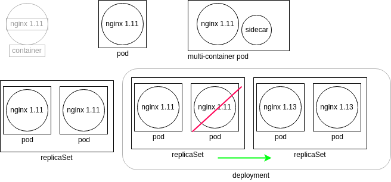

## Course Reading

### Learning objectives

- Discuss Deployment configuration details
- Scale Deployments up and down
- Implement rolling updates and rollback
- Use Labels to select various objects


### Overview

When you run `kubectl run`, the default controller is a Deployment. This chapter focuses more in detail in the configuration of them.  Deployments, like other objects, can be defined in YAML or JSON, and when added to the cluster, a ReplicaSet and Pod will be created automatically.  

Deployment settings can be changed via an update which will create a new ReplicaSet which will then create new Pods. Updates can be applied as a block change or via a rolling update. Most updates can be configured by editing the YAML file defining the object and then running a `kubectl apply`. A `kubectl edit` can also be used to modify the in-use config.  Previous ReplicaSet versions are kept in case a rollback is needed.

This section also focuses on labels. These are essential for Kubernetes administration, but they are not an API resource.  Labels are user defined key-value pairs attached to resources stored in the object metadata.  Tey can be used to query or select resources in the cluster, which allows for flexible and complex management. Since labels are arbitrary, you can select all resources that share a label value without having to figure out what kind or how many of these resources exist.


### Deployments

Deployments came about as enhanced versions of ReplicaControllers (RC). ReplicaControllers ensure a specified number of Pod replicas are running at any one time.  They also give the ability to perform rolling updates, however all updates are managed on the client side, which is problematic if the client loses connection which can leave the cluster in an unplanned state.

To avoid these issues Deployments were introduced in the `apps/v1` API group.  They allow for server-side updates to Pods at specified rates.  Deployments can be used for canary and other deployment patterns. A Deployment generates a ReplicaSet, which offer more selection features than ReplicaControllers. One example is `matchExpressions`.

You can create a Deployment from an existing image with `kubectl` like so

```bash
kubectl create deployment dev-web --image=nginx
```


### Object relationship



The diagram shows relationships between Kubernetes object.  Each of the boxes represent the controllers running as a thread of the kube-controller-manager, where each controller queries the kube-apiserver for the current state of the tracked object.

Walking through the diagram, we first see a Nginx container running version 1.11.  Kubernetes does not directly manage the container. Instead, the kubelet daemon checks the Pod spec by checking the runtime engine for the current status.  Next to the container we see a Pod, which is a representation of a watch loop checking the container status. The kubelet continues to compare the container spec to the response from the runtime engine, and will terminate the Pod if needed. Next to the Pod is an example of a multi-container Pod.  This works on the same principle as a single container Pod, except the watch loop needs to monitor both containers in this case.

Next is the ReplicaSet, which is a controller that ensured a certain number of replicas of a Pod are running. Each Pod is deployed with the same specification. If a Pod is terminated or a new one is found, the ReplicaSet will create or terminate Pods until the number of running Pods matching the specified replica count.  Since all the replicas are the same, any could be terminated should the spec demand a change in the number of running Pods.

Finally we have the deployment, which is a controller that manages the ReplicaSets.  They allow us to manage the version of images running in the Pods they oversee.  If a Deployment is changes, a new ReplicaSet is created, which in turn deploys new Pods using the updated podSpec. Once new Pods are running the Deployment instructs the old ReplicaSet to start terminating its Pods and eventually itself once the Pods are all shut down, and only the new ReplicaSet, with its Pods, is running.


### Deployment details

If you ran the command to create the `nginx` deployment in the [Deployments](#deployments) section above you could then list the YAML or JSON output for the resources it just created like so:

```bash
kubectl get deployments,rs,pods -o yaml
kubectl get deployments,rs,pods -o json
```

The first few lines of the YAML response should look like this.

```yaml
apiVersion: v1
items:
- apiVersion: apps/v1
  kind: Deployment
```

Let's discuss each of these lines.

First is the `apiVersion`.  This denotes the stability of the object we ar looking at.  `v1` denotes the object as stable, and it referring to the `List` type that the `items` parameter defines.

Within the `items` we see the first object has an `apiVersion` of `apps/v1`, which means it is also stable.  We also see the `kind` field, showing us we are looking at the specification for a `Deployment`.


### Deployment configuration metadata

Continuing from the YAML output we got from the [previous section](#deployment-details), we next see the `metadata` field for the deployment which looks something like this.

```yaml
  metadata:
    annotations:
      deployment.kubernetes.io/revision: "1"
    creationTimestamp: "2022-05-10T18:21:45Z"
    generation: 1
    labels:
      app: dev-web
    name: dev-web
    namespace: default
    resourceVersion: "278969"
    uid: 519529f2-6e77-4413-8df5-c498bd127e71
```

This is the section that would contain any labels, annotations, or other non-configuration information.  Here's what each of the sub-parameters in the `metadata` is used for:

#### `annotations`

These values do not configure the object, but are helpful to provide further information for tracking or for third-party applications.  Unlike labels, annotations cannot be used for selection with `kubectl`.

#### `creationTimestamp`

This is the original creation time of the object. It does __not__ update when the object is updated.

#### `generation`

Is a count of how many times the object has been edited. Changing things such as the number of replicas would modify this field.

#### `labels`

Labels are similar to annotations except they can be used for selection with `kubectl` or other API calls.  This is helpful for cluster administration to select groups of different objects that may be related or for excluding other objects from queries.

#### `name`

This metadata field is a required string value. When we created the object we passed it, `dev-web`.  The name must be unique to the namespace the object is a part of.

#### `resourceVersion`

This is a value tied to the etcd database to help with object concurrency.  Changes to the database cause this number to change.

#### `uid`

A unique ID for the life of the object.


Also, it should be noted that the output will not include every configuration setting, as many are set to false by default and therefore are not shown, such as `podAffinity` and `nodeAffinity`.


### Deployment configuration spec

Continuing on down the output, we next see the `spec` section. There a two `spec` declarations for a deployment, the first is for ReplicaSet, and the second for the Pod.  The first one looks like this in the output from previously.


```yaml
  spec:
    progressDeadlineSeconds: 600
    replicas: 1
    revisionHistoryLimit: 10
    selector:
      matchLabels:
        app: dev-web
    strategy:
      rollingUpdate:
        maxSurge: 25%
        maxUnavailable: 25%
      type: RollingUpdate
```

#### `progressDeadlineSeconds`

This is the time until a progress error is reported when a change occurs.  These errors could happen for a variety of reasons, such as quotas, image issues, or limit ranges.

#### `replicas`

Since this `spec` defines a ReplicaSet, this parameter is needed to determine how many replicas of a Pod the ReplicaSet needs to ensure. If you changes the replicas to 2 with a `kubectl edit`, a second Pod would be spun up.

#### `revisionHistoryLimit`

This is the number of old ReplicaSet specifications that are retained in case a rollback is needed.

#### `selector`

The `selector` field is a collection of values ANDed together. All must be satisfied for the replica to match.  Do not create a Pod that matches these selectors as the Deployment controller could potentially try to control these resource, leading to issues.

The `matchLabels` sub-parameter define set-based requirements for the Pod selector.  This is often paired with the `matchExpressions` statement as well to further define where resources should be scheduled.

#### `strategy`

The strategy section defines values regarding updates for Pods. It works with the later defined `type` field which specifies the strategy for updating Pods. In the case of the example, it is a `RollingUpdate`, which has other parameters that can be defined to control the number of Pods deleted at a time.  Even through it is defined last here, it is what is read to determine the object being configured.

For a `RollingRestart` we can define `maxSurge` and `maxUnavailable` fields.  The `maxSurge` parameter defines the number of Pods that can be created above the desired limit.  It can be a percentage, like the default 25% here, or an absolute number.  This creates a certain number of new Pods before deleting any old ones for continued access to the running application.  The `maxUnavailable` field is the configured number or percentage of Pods that can be in a state other than `Ready` during the update process.

The `strategy` could also be set to `Recreate` which would delete all existing Pods before creating any new ones.


### Deployment configuration Pod template

Next is the `template` section, which is actually contained within the `spec` section we discussed about [above](#deployment-configuration-spec). it looks something like this:

```yaml
    template:
      metadata:
        creationTimestamp: null
        labels:
          app: dev-web
      spec:
        containers:
        - image: nginx:1.13.7-alpine
          imagePullPolicy: IfNotPresent
          name: nginx
          resources: {}
          terminationMessagePath: /dev/termination-log
          terminationMessagePolicy: File
        dnsPolicy: ClusterFirst
        restartPolicy: Always
        schedulerName: default-scheduler
        securityContext: {}
        terminationGracePeriodSeconds: 30
```

This is the template used for each of the Pods to be deployed. Again, let's break down each section.

#### `template`

The template header defines the configuration that is passed to the ReplicaSet for how to deploy an object (in this case Pods/containers).

We again see a `metadata` section which serves the same function [as discussed here](#deployment-configuration-metadata).

#### `containers`

This keyword indicates the following items of the array are specification for the containers that will be deployed in the Pod. Each container has some more keywords to configure.

The first is __`image`__, which is the name of the image passed to the container runtime engine.  The engine pulls the image and creates the Pod.

We also define an __`imagePullPolicy`__ to define when and if an image should be downloaded or if the locally cached image should be used. This can take three values. `IfNotPresent` pulls the image only if it is not present locally.  `Always` will make the kubelet alway query the container registry to pull the image before launching a new one. `Never` will make the kubelet never pull the image, which causes startup to fail if the image is not present locally already.

The __`name`__ field denoted the stub of the Pod name, with a unique string being appended to the end.

__`resources`__ by default are empty.  This is where any resource restrictions or limits, like for CPU or memory, would be configured for the containers.

The __`terminationMessagePath`__ defines the location where to output success or failure information from a container. The __`terminationMessagePolicy`__ holds the termination method.  The default is `File`, but it can also be set to `FallbackToLogsOnError` which uses the last chunk of container logs if the message file is empty and the container is showing an error.

#### `dnsPolicy`

This determines is the DNS queries should go through __coredns__.  If set to `Default`, the node's DNS resolution configuration is used.

#### `restartPolicy`

This defines is containers should be restarted if killed.  Automatic restarts are part of the usual strength of Kubernetes.

#### `schedulerName`

This allows for the use of a custom scheduler if you don't want to use the Kubernetes default.

#### `securityContext`

A flexible setting to pass one or many security settings. These could include SELinux context, AppArmor values, users, and UIDs for the containers to use.

#### `terminationGracePeriodSeconds`

Sets the amount of time to wait for a `SIGTERM` to run before a `SIGKILL` is used to terminate the container.


### Deployment configuration status

Now, let's take a look at the `status` section of the output for our Deployment object.

```yaml
  status:
    availableReplicas: 1
    conditions:
    - lastTransitionTime: "2022-05-10T18:21:47Z"
      lastUpdateTime: "2022-05-10T18:21:47Z"
      message: Deployment has minimum availability.
      reason: MinimumReplicasAvailable
      status: "True"
      type: Available
    - lastTransitionTime: "2022-05-10T18:21:45Z"
      lastUpdateTime: "2022-05-10T18:21:47Z"
      message: ReplicaSet "dev-web-565cb67bd6" has successfully progressed.
      reason: NewReplicaSetAvailable
      status: "True"
      type: Progressing
    observedGeneration: 1
    readyReplicas: 1
    replicas: 1
    updatedReplicas: 1
```

Some sections to note in the `status` are the `availableReplicas` and `observedGeneration` fields.  The `availableReplicas` indicates how many replicas were configured by the ReplicaSet.  This is then later compared to `readyReplicas` to determine if all have been fully created without error.

The `observedGeneration` parameter shows how often the deployment has been updated, which can be used to understand the rollout and rollback situation of the deployment.


### Scaling and rolling updates

The kube-apiserver allows most configuration settings to be updated, however there are some that are immutable which can differ depending on the version of Kubernetes deployed.

A more common update is scaling the number of replicas for a Deployment.  You could in theory also scale a Deployment to 0 replicas, leaving just a ReplicaSet and a Deployment, which behind the scenes is what happens when a Deployment is deleted. As an example, let's scale the Nginx deployment we created earlier.

```bash
kubectl scale deploy/dev-web --replicas=4
```

For immutable values, we can edit the deployment and trigger an update.  Again, using the example of our Nginx deployment we could do

```bash
kubectl edit deployment dev-web
```

This would open up a text editor and you could make a change, like for example the image version.

```yaml
...
      containers:
      - image: nginx:1.8   # <-- Update this to an older version
        imagePullPolicy: IfNotPresent
        name: nginx
...
```

The `edit` command then triggers the update of the Deployment. While the Deployment shows its age as the original creation time, inspecting the Pods would show that they had been recently created.


### Deployment rollbacks

Some previous ReplicaSets and Deployments are kept in the case a rollback is needed.  The number kept is configurable and changes version to version.  Let's take a loot at how rollbacks can be made.

```bash
kubectl create deploy ghost --image=ghost
kubectl get deploy ghost -o yaml
```

This is what the deployment should look like:

```yaml
apiVersion: apps/v1
kind: Deployment
metadata:
  annotations:
    deployment.kubernetes.io/revision: "1"
  creationTimestamp: "2022-05-11T16:17:57Z"
  generation: 1
  labels:
    app: ghost
  name: ghost
  namespace: default
  resourceVersion: "296422"
  uid: 985f8c5a-8040-4c00-81b9-833dd03bde0a
spec:
  progressDeadlineSeconds: 600
  replicas: 1
  revisionHistoryLimit: 10
  selector:
    matchLabels:
      app: ghost
  strategy:
    rollingUpdate:
      maxSurge: 25%
      maxUnavailable: 25%
    type: RollingUpdate
  template:
    metadata:
      creationTimestamp: null
      labels:
        app: ghost
    spec:
      containers:
      - image: ghost
        imagePullPolicy: Always
        name: ghost
        resources: {}
        terminationMessagePath: /dev/termination-log
        terminationMessagePolicy: File
      dnsPolicy: ClusterFirst
      restartPolicy: Always
      schedulerName: default-scheduler
      securityContext: {}
      terminationGracePeriodSeconds: 30
status:
  availableReplicas: 1
  conditions:
  - lastTransitionTime: "2022-05-11T16:18:15Z"
    lastUpdateTime: "2022-05-11T16:18:15Z"
    message: Deployment has minimum availability.
    reason: MinimumReplicasAvailable
    status: "True"
    type: Available
  - lastTransitionTime: "2022-05-11T16:17:57Z"
    lastUpdateTime: "2022-05-11T16:18:15Z"
    message: ReplicaSet "ghost-5c7f765cdc" has successfully progressed.
    reason: NewReplicaSetAvailable
    status: "True"
    type: Progressing
  observedGeneration: 1
  readyReplicas: 1
  replicas: 1
  updatedReplicas: 1
```

If an update were to fail, you can roll back to a previous version with a `kubectl rollout undo`

```bash
kubectl set image deployment/ghost ghost=ghost:09 --all
kubectl rollout history deployment/ghost
kubectl get pods
```

When getting the Pods, you should see the new `ghost` Pod is erroring, likely with a `ErrImagePull` or `ImagePullBackOff` status since the tag we specified on the image was bad.

To fix this we can undo the change.

```bash
kubectl rollout undo deployment/ghost
kubectl get pods
```

You should then see the `ghost` Pod working normally again.  You can also specify a specific revision to roll back to using the `--to-revision=` flag and specifying the revision number from the `rollout history` command.

Deployments can be paused and resumes as well with

```bash
kubectl rollout pause deployment/ghost
kubectl rollout resume deployment/ghost
```

ReplicationControllers can have rolling updates applied with `kubectl rolling-update` command, but as mentioned before, this is done on the client side. So if a connection is lost the update will stop.


### Using DaemonSets

A newer object is a `DaemonSet`, which ensures a single Pod is running on each cluster node.  Every Pod the DaemonSet manages uses the same image, and when new nodes are added, the controller will deploy a new, identical Pod on it. If the node is removed, the controller will also delete the Pod first.

DaemonSets are useful in that it ensured a particular container is always running on every node, which in a large dynamic environment is helpful so an administrator does not always need to remember to deploy certain things, like for example a logging or metric generation application.

There are ways to effect the kube-apiserver so that DaemonSets do not run on certain nodes.


### Labels

Labels are an important tool for cluster administration.  They can be used for selection using an arbitrary string regardless of the object type.  Labels are immutable as of `apps/v1`.

Any resource can contain labels in its metadata. By default, when you use `kubectl create` to launch a Deployment, some labels are added.

```yaml
...
  labels:
    app: ghost
    pod-template-hash: 5c7f765cdc
...
```

Here are some examples of using and adding labels.

For example, you could get Pod with the label `app` and a value of `ghost`.

```bash
kubectl get pods -l app=ghost
```

Or you could get all the Pods with the `app` label and list their values as another column like so.

```bash
kubectl get pods -L app
```

Labels are usually defined in Pod templates in Deployment spec but you can also add them on the fly.

```bash
kubectl label pods ghost-<uid> foo=bar
```

And you can show the labels on each pod with a `get`

```bash
kubectl get pods --show-labels
```

## Lab Exercises

### Lab 7.1 - Working with ReplicaSets

