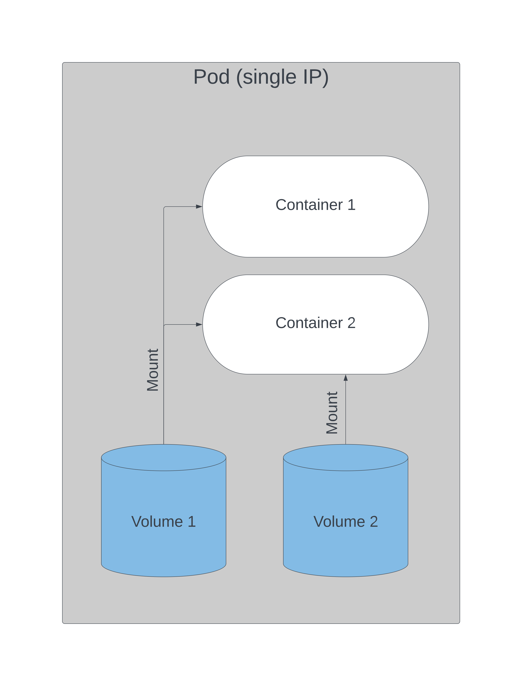

## Course Reading

### Learning objectives

- Understand and create persistent volumes
- Configure persistent volume claims
- Manage volume access modes
- Deploy applications with persistent data storage
- Discuss dynamic provisioning of storage
- Configure secrets and ConfigMaps


### Overview

Traditionally container engines do not offer storage that outlasts the container, since the container is seen as transient.  This could potentially lead to data loss or the need for complex data storage schemes.

In Kubernetes, __volumes__ share the lifetime of a Pod, not the containers in them.  If a container terminates, the next one still has the data. Volumes are directories, sometimes pre-populated, that is made available to the containers in a Pod.  Volume creation, backend storage, and the data/contents is dependent on the type of volume, of which there are many, which you can [read about here](https://kubernetes.io/docs/concepts/storage/volumes/#volume-types), each with different configuration and dependencies.

There is an effort to adopt the Container Storage Interface (CSI) to reach an industry standard interface for container orchestration to allow access to arbitrary storage systems. Currently, all volume plug-ins are "in-tree", meaning they are built with the Kubernetes source code. A swap to an "out-of-tree" model means 3rd-parties just need to develop their own driver to allow their plugin to be containerized, replacing the Flex plugin which has major security concerns.

Sometimes you may also want the storage to have a lifetime that exceeds a Pod as well, and for this __persistent volumes__ are used.  These allow volumes to out live Pods, and then be claimed by Pods with a Persistent Volume Claim. If one Pod is terminated, another one can come along and claim the persistent volume.

Two API object previously seen to pass data to Pods are ConfigMaps (for non-encoded data) and Secrets (for encoded data). These two object let you easily pass things like SSH keys, passwords, or configuration to the Pods, just to name a few use cases.


### Introducing volumes



Volumes can be defined in podSpec and where they are made available.  Each volume configuration requires a name, type, and mount point.One volume can be made available to multiple containers within the Pod, and this can be used as method of communication between containers.  Volumes can also be made available to multiple Pods, and each Pod has access to write to the volume.  Volumes have no concurrency checking, so the potential for corruption when enabling a volume for access from multiple Pods is high unless there is an outside mechanism to lock changes when others are in progress.

An access mode is part of the Pod request. As a request, more access may be granted, but not less, and an exact match is attempted to be made.  The cluster groups all the volumes from the requested mode and sorts from smallest to largest.  The claim is then checked against the list for the mode until one of sufficient size is found.  There are three access modes.:

- __ReadWriteOnce__ allows read-write by a single node
- __ReadOnlyMany__ allows read only access by multiple nodes
- __ReadWriteMany__ allows read-write access by multiple nodes

Two Pods on the same node can write to a volume that has a ReadWriteOnce access mode, but a Pod on another node would not become ready if trying to attach to that volume due to a `FailedAttachVolume` error.

When a volume is requested, the local kubelet run the `kubelet_pods.go` script to get a map of all the devices, determine and create mount points for containers, and then create the symlink on the host node file system to associate the storage to the container.  The API server requests the storage from the `StorageClass` plugin.

If a request for a StorageClass was not made, only the parameters for access mode and size will be used. The volume could come from any of the storage options available, there is no configuration to determine which of the available will be used.


### Volume spec

On of many types of storage options in Kubernetes is the `emptyDir`. The kubelet creates a directory in the container, but does not mount any storage.  Any data is written to the shared container space, and as a result is not persistent. When a Pod is destroyed, the data is deleted with the container.

```yaml
apiVersion: v1
kind: Pod
metadata:
  name: test-pd
spec:
  containers:
  - image: k8s.gcr.io/test-webserver
    name: test-container
    volumeMounts:
    - mountPath: /cache
      name: cache-volume
  volumes:
  - name: cache-volume
    emptyDir: {}
```

The YAML above creates a single container Pod with a volume, named `cache-volume`, which would be created in the `/cache` directory in the container.


### Volume types

There are quite a few different volume type that can be used, some using local storage, others using networked resources.

For GCE, AWS, and Azure, there were the `gcePersistentDisk`, `awsElasticBlockStore`, and `azureDisk` and `azureFile`, all of these not being depreciated, replaced with new out-of-tree plugins being in alpha or beta that use the new CSI features.

There are `emptyDir` and `hostPath` volumes which are easy to use. The `emptyDir` was already discussed. The `hostPath` volume type mounts a resource from the host node filesystem. The resource could be a directory, file socket, character, or block device.  The resource must already exist on the host to be used, and there are two types, `DirectoryOrCreate` and `FileOrCreate`, which create the resource on the host and then use them if they do not exist already.

For scenarios with multiple readers a network file system (`nfs`) or a Internet Small Computer System Interface (`iscsi`) are easy choices.

For multiple writers good choices are `rdb` for a block storage option, or `cephfs` or `glusterfs` if either are configured on the cluster.

All available volume types can be read about on the official [Kubernetes docs page](https://kubernetes.io/docs/concepts/storage/volumes/).

The CSI allows for more flexibility and decoupling plugins from the Kubernetes source code. It exists so that arbitrary plugins can be exposed more easily in the future.


### Shared volume example

```yaml
...
  containers:
  - name: alphacont
    image: busybox
    volumeMounts:
    - mountPath: /alphadir
      name: sharevol
  - name: betacont
    image: busybox
    volumeMounts:
    - mountPath: /betadir
      name: sharevol
  volumes:
  - name: sharevol
    emptyDir: {} 
```

The snipping from the YAML above would produce a Pod named `exampleA` that has two containers both with access to a volume, `sharevol`. An `emptyDir` or `hostPath` could both easily be used here since both require no additional setup.

If the Pod was created and then the following commands are run

```bash
kubectl exec -it exampleA -c betacont -- touch /betadir/foobar
kubectl exec -it exampleA -c alphacont -- ls -l /alphadir
```

you should see a `foobar` file in the `alphadir` even though the other container wrote the data.  The containers have immediate access to any data the either of them write to the shared volume, and there is nothing stopping them from overwriting each others data. Locking or versioning of the data written by the containers must be considered and implemented into the containerized application to avoid issues with corrupted data.


### Persistent volumes and claims

A persistent volume (pv) is another storage abstraction used to give data a lifetime that exceeds that of a Pod. Pods define a volume that used the type `persistentVolumeClaim` (`pvc`). The pvc has various parameters to define the size and the type of backend storage, known as the `StorageClass`.  The cluster then attached the `persistentVolume`.  The cluster will dynamically use volumes that are available, irrespective of the storage type, allowing the claims to use ay backend storage.

#### Phases of persistent storage

__Provisioning__ of the persistent volumes can take a few forms. For example, they could be defined ahead of time by the administrator of the cluster, or they might dynamically be created, say by a request from a cloud provider.

A __binding__ operation occurs when a watch loop see a new PVC, which contains the storage size, access request, and optionally, a `StorageClass`.  The controller locates a PV that matches this request, or it may have to wait for the `StorageClass` provisioner to create a new one.  The PV must meet the requested storage size, but it could contain more if only larger PV are available.

__Use__ of the PV begins when the volume is mounted to a Pod and continues through the lifetime of that Pod.

When the Pod is done with the volume and an API request is sent, the PVC is deleted and the volume is said to be __released__.  The volume remains in the same state from when the claim was deleted until it available to a new claim.  The data on the volume is retained depending on the defined `persistentVolumeReclaimPolicy`.

Volumes are __reclaimed__ when one of three options happen:

- A __retain__, which keeps the data and allows the admin to handle the storage and data.
- A __delete__, removing the API object and the associated storage.
- A __recycle__, which runs a `rm -rf /mountpoint` and then makes the volume available to a new claim.  With dynamic provisioning reaching good stability, this is intended to be depreciated.


Like with other API object, PVs and PVCs can be viewed and described with `kubectl`.

```bash
kubectl get pv
kubectl get pvc
```


### Persistent Volume

Here is a basic example of a PV declaration that uses a `hostPath` as the storage type.

```yaml
kind: PersistentVolume
apiVersion: v1
metadata:
  name: 10Gpv01
  labels: 
    type: local 
spec:
  capacity: 
    storage: 10Gi
  accessModes:
  - ReadWriteOnce
  hostPath:
    path: "/somepath/data01"
```

Each storage type has its own configuration settings.  An example would be a Ceph or GE Persistent Disk that already exists, so it would not need to be configured and would just need to be claimed from the provider.

PVs are not namespaced objects, but PVCs are. Stable as of v1.18, Raw Block Volumes are allowed to be statically provisioned, supporting a handful of different volume plugins, which you can find [an up-to-date list of here](https://kubernetes.io/docs/concepts/storage/persistent-volumes/#raw-block-volume-support).

Locally attached storage is also a stable feature, often used as a part of distributed file systems or for databases.


### Persistent Volume Claim

Once a PV has been created in the cluster, a manifest for a claim can be written and the claim used by a Pod definition.  In the Pod, the volume is a `persistentVolumeClaim`.

```yaml title={Persistent Volume Claim manifest}
kind: PersistentVolumeClaim
apiVersion: v1
metadata:
  name: myclaim
spec:
  accessModes:
  - ReadWriteOnce
  resources:
    requests:
      storage: 8GI
```

```yaml title={Pod manifest using PVC}
...
  spec:
    containers:
    ...
    volumes:
    - name: test-volume
      persistentVolumeClaim:
        claimName: myclaim
```

That example is rather simple. A more complex configuration might look like

```yaml title={Complex PVC usage}
...
  volumeMounts:
  - name: Cephpd
    mountPath: /data/rbd
  volumes:
  - name: rbdpd
    rbd:
      monitors:
      - '10.19.14.22:6789'
      - '10.19.14.23:6789'
      - '10.19.14.24:6789'
      pool: k8s
      image: client
      fsType: ext4
      readOnly: true
      user: admin
      keyring: /etc/ceph/keyring
      imageformat: "2"
      imagefeatures: "layering"
```


### Dynamic provisioning

Using persistent volumes and abstracting that storage with a claim were very powerful, but it originally required an administrator to create them.  Starting in Kubernetes v1.4, dynamic provisioning was added so that a cluster could request storage from an external, pre-configured source.  

The `StorageClass` API resources lets admins define a persistent volume provisioner. This is of a certain type with storage specific configuration.  Once created, users can request a claim from the `StorageClass`, and the API fills this via auto-provisioning. The resource will be reclaimed as configured by the provider.  Common choices from dynamic storage are AWS and GCE, and there are other options like a Ceph cluster or iSCSI.

This is an example of an AWS `StorageClass` using gp2 storage:

```yaml
kind: StorageClass
apiVersion: storage.k8s.io/v1
metadata:
  name: gp2
  annotations:
    storageclass.kubernetes.io/is-default-class: "true"
provisioner: kubernetes.io/aws-ebs
parameters:
  type: gp2
  fsType: ext4
```


### Using Rook for storage orchestration

Rook is a project that allows for orchestration of storage by multiple providers. As with other agents within Kubernetes, Rook uses custom resource definitions (CRD) and a custom operator to handle the provisioning of storage according to backend storage type.  Currently several storage providers are supported, such as Ceph, Cassandra, and Network File System (NFS).

You can learn more about the project [here](https://rook.io/).


### Secrets

For data you don't want readable to the naked eye, like a password, you can use secrets. Secret API resources can take this data and encode or encrypt it so it is not easily readable.

You can create, get, and delete secrets like so:

```bash
kubectl create secret generic --help
kubectl create secret generic mysql --from-literal=password=root
kubectl get secrets
kubectl delete secret mysql
```

Secrets are not encrypted by default, but instead are base64 encoded. To encrypt secrets you must create an `EncryptionConfiguration` with a key and proper identity.  Then the kube-apiserver needs to have the `--encryption-provider-flag` enabled to a previously configured provider (e.g. `aescbc` or `ksm`). Once enabled, every secret must be recreated since the encryption happens on the write.

You can have multiple keys, each is tried during decryption.  The first key of the first provider is used to encrypt secrets. To rotate them, create a new key, restart all kube-apiserver processes, and then recreate all secrets.

The encoded string in the secret can be viewed with `kubectl`.  The secret is decoded and saved as a string to file, which can be used as an environment variable or in a new directory, similar to how a volume is mounted.

Secrets can be made manually with a manifest as well by pasting the encoded string into the manifest.  Here is an example:

```bash
echo LFTr@1n | base64
vim secret.yaml
```

```yaml title={secret.yaml}
apiVersion: v1
kind: Secret
metadata:
  name: lf-secret
data:
  password: TEZUckAxbgo=
```

where the output of the `echo` command is entered as the `password` value.


### Using secrets via environment variables

You can configure a secret as an environment variable for a Pod in a manifest like so:

```yaml
...
  spec:
    containers:
    - image: mysql:5.5
      name: dbpod
      env:
      - name: MYSQL_ROOT_PASSWORD
        valueFrom:
          secretKeyRef:
            name: mysql
            key: password
```

There is not a limit to the number of secrets used, but a secret can only be up to 1 MB in size.  Secrets, just like any other API object, takes up memory, so with large numbers you can deplete memory on a node.

Secrets are stored in `tmpfs` storage on the host node, and only get sent to the host Pod.  All volumes that a Pod request must exist before containers are started, secrets are no different.


### Mounting secrets as volumes

Secrets can also be mounted as files using volume definitions.  The mount path contains a file with the name of the secret.

```yaml
...
  spec:
    containers:
    - image: busybox
      command:
        - sleep
        - "3600"
      volumeMounts:
      - mountPath: /mysqlpassword
        name: mysql
      name: busy
    volumes:
    - name: mysql
        secret:
          secretName: mysql
```

Once the Pod is up and running, you can verify a secret is accessible with

```bash
kubectl exec -it busybox -- cat /mysqlpassword/password
```


### Portable data with ConfigMaps

ConfigMaps are similar to secrets, but the data they contain is not encoded.  ConfigMaps decouple a container image from their configuration artifacts (and this fits well with Kubernetes model of decoupling). Data is stored as key-value pairs or plain configuration files of any format, and it can come from a collection of files or all files in a directory. ConfigMaps can also be populated from a literal value.

Here's an example of how you might use a ConfigMap.  Assume you have a YAML (or any other file type) configuration file on your local machine. You can create a `configmap` object that contains this data. The `data` section of the ConfigMap will contain the configuration when you view the object.

```bash
kubectl get configmap envyaml -o yaml
```

```yaml
kind: ConfigMap
apiVersion: v1
metadata:
  name: envyaml
data:
  env.yaml: |
    ...
```

ConfigMaps are consumed in multiple ways:

- Pod environment variables from one or many ConfigMaps
- For Pod commands
- Populate a volume, or add ConfigMap data to specific path within a volume
- Set file names and access modes in a volume
- Use by system components or controllers


### Using ConfigMaps

Like secrets, Configmaps must exist prior to use (unless they are marked as optional) and are namespace dependent.

Let's first look at the use case of setting an environment variable. The manifest defining the Pods will use a `valueFrom` key and a `configMapKeyRef` value to get the data from the ConfigMap.

```yaml
apiVersion: v1
kind: Pod
metadata:
  name: envar-demo
spec:
  containers:
  - name: envar-demo-container
    env:
    - name: ENVIRON_VAR_VALUE
      valueFrom:
        configMapKeyRef:
          name: some-config
          value: someconfig.how
```

Now let's look at creating a volume with a ConfigMap.

```yaml
apiVersion: v1
kind: Pod
metadata:
  name: configmap-volunes
spec:
  volumes:
  - name: config-volume
    configMap:
      name: some-config
```


## Lab Exercises

### Lab 8.1 - Create a ConfigMap

ConfigMaps can ingest data in 3 ways, from a literal value, from files, or from directories.  Let's start by creating some data to ingest into a ConfigMap via file and directory.

```bash
mkdir primary
echo c > primary/cyan
echo m > primary/magenta
echo y > primary/yellow
echo k > primary/black
echo "known as key" >> primary/black
echo blue > favorite
```

And now let's create a ConfigMap with this data using all three types of data ingestion.

```bash
kubectl create configmap colors \
    --from-literal=text=black \  # Using a literal value
    --from-file=./favorite \     # Using a file
    --from-file=./primary/       # Using a directory
```

Now let's view the ConfigMap in the cluster.

```bash
kubectl get configmap colors
kubectl get configmap color -o yaml
```

With a ConfigMap successfully created, we can now use it in a Pod.

```bash
vim simpleshell.yaml
```

```yaml title={simpleshell.yaml}
apiVersion: v1
kind: Pod
metadata:
  name: shell-demo
spec:
  containers:
  - name: nginx
    image: nginx
    env:
    - name: ilike
      valueFrom:
        configMapKeyRef:
          name: colors
          key: favorite
```

In this case we are using the ConfigMap to define an environment variable, `ilike`.  Now let's create the Pod and check the variable's value, the we can delete it.

```bash
kubectl create -f simpleshell.yaml
kubectl exec shell-demo -- /bin/bash -c 'echo $ilike'
kubectl delete pod shell-demo
```

All variables in a ConfigMap can be included as environment variables.  We cna replace the `env` section in our YAML manifest with an `envFrom`. Open the `simpleshell.yaml` in vim and change it to this:

```yaml title={simpleshell.yaml}
apiVersion: v1
kind: Pod
metadata:
  name: shell-demo
spec:
  containers:
  - name: nginx
    image: nginx
  #  env:
  #  - name: ilike
  #    valueFrom:
  #      configMapKeyRef:
  #        name: colors
  #        key: favorite
    envFrom:
    - configMapRef:
        name: colors
```

Then create the Pod and check the environment variables. You should see `black`, `cyan`, `yellow`, `text`, `favorite`, and `magenta` environment variables. Then you can delete the Pod again.

```bash
kubectl create -f simpleshell.yaml
kubectl exec shell-demo -- /bin/bash -c 'env'
kubectl delete pod shell-demo
```

ConfigMaps can also be defined in YAML. Let's create a new one using that method.

```bash
vim car-map.yaml
```

```yaml title={car-map.yaml}
apiVersion: v1
kind: ConfigMap
metadata:
  name: fast-car
  namespace: default
data:
  car.make: Ford
  car.model: Mustang
  car.trim: Shelby
```

Then we can create the ConfigMap and view it.

```bash
kubectl create -f car-map.yaml
kubectl get configmap fast-car -o yaml
```

We'll use this ConfigMap to mount it as as volume to a Pod.  We'll reuse out `simpleshell.yaml`, open it and `vim` and edit it to match the new spec by removing the `env` and `envFrom` fields and adding in new `volumeMounts` and `volumes` configuration.

```yaml title={simpleshell.yaml}
apiVersion: v1
kind: Pod
metadata:
  name: shell-demo
spec:
  containers:
  - name: nginx
    image: nginx
    volumeMounts:
    - name: car-vol
      mountPath: /etc/cars
  volumes:
  - name: car-vol
    configMap:
      name: fast-car
```

Now let's create the Pod again and then inspect the mounted volume.

```bash
kubectl create -f simpleshell.yaml
kubectl exec shell-demo -- /bin/bash -c 'df -ha |grep car'
kubectl exec shell-demo -- /bin/bash -c 'cat etc/cars/car.trim'
```

We can then delete the Pod and the ConfigMaps.

```bash
kubectl delete pod shell-demo
kubectl delete configmap fast-car colors
```


### Lab 8.2 - Create a persistent NFS volume (PV)

To set up an NFS PV we first need an NFS server.

```bash
sudo apt-get update && sudo apt-get install -y nfs-kernel-server
```

Then we will make and populate a directory to be shared.

```bash
sudo mkdir /opt/sfw
sudo chmod 1777 /opt/sfw
sudo bash -c 'echo software > /opt/sfw/hello.txt'
```

Now we will edit the NFS file server to share the new directory we created.  We will begin by sharing the directory to all but we can adjust this later if needed by using `snoop` to see the inbound request and then update to a more narrow scope.

```bash
sudo vim /etc/exports
```

When `vim` opens, add the following line:

```
/opt/sfw/ *(rw,sync,no_root_squash,subtree_check)
```

And then force the file to be re-read.

```bash
sudo exportfs -ra
```

:::important Worker Node
Now let's switch to the worker node and test the NFS by mounting and inspecting it.

```bash
sudo apt-get -y install nfs-common
showmount -e k8scp
sudo mount k8scp:/opt/sfw /mnt
ls -l /mnt
```

You should see the `hello.txt` file we created on the cp node.
:::

Now back on the cp node, let's create a YAML file to define the persistent volume. When defining a persistent volume in YAML, only syntax is checked, so any misspelling in a directory name will not cause an error, but the Pod will not start.  Note `accessModes` do not affect actual access and are usually used as labels.

```bash
vim PVol.yaml
```

```yaml title={PVol.yaml}
apiVersion: v1
kind: PersistentVolume
metadata:
  name: pvvol-1
spec:
  capacity:
    storage: 1Gi
  accessModes:
  - ReadWriteMany
  persistentVolumeReclaimPolicy: Retain
  nfs:
    path: /opt/sfw
    server: k8scp
    readOnly: false
```

Then we can create the PV and check it was created.

```bash
kubectl create -f PVol.yaml
kubectl get pv
```


### Lab 8.3 - Creating a persistent volume claim (PVC)

First check to see if any PVCs exist.

```bash
kubectl get pvc
```

Now define and then create a new PVC.

```bash
vim pvc.yaml
```

```yaml title={pvc.yaml}
apiVersion: v1
kind: PersistentVolumeClaim
metadata:
  name: pvc-one
spec:
  accessModes:
  - ReadWriteMany
  resources:
    requests:
      storage: 200Mi
```

```bash
kubectl create -f pvc.yaml
kubectl get pvc,pv
```

Notice when you got the PVC, it was 1Gi even though the request was for 200Mi. When you check the PV, you should now see the status as `BOUND`.

Now create a new Deployment that will use the PVC.  We can reuse one of our old deployments. We'll update the name and add a `volumeMounts` and `volumes` section.  The `claimName` in the configuration must match an exist PVC.

```bash
cp first.yaml nfs-pod.yaml
vim nfs-pod.yaml
```

```yaml title={nfs-pod.yaml}
apiVersion: apps/v1
kind: Deployment
metadata:
  annotations:
    deployment.kubernetes.io/revision: "1"
  generation: 1
  labels:
    app: nginx
  name: nginx-nfs
  namespace: default
spec:
  replicas: 1
  selector:
    matchLabels:
      run: nginx
  strategy:
    rollingUpdate:
      maxSurge: 1
      maxUnavailable: 1
    type: RollingUpdate
  template:
    metadata:
      creationTimestamp: null
      labels:
        run: nginx
    spec:
      containers:
      - image: nginx
        imagePullPolicy: Always
        name: nginx
        volumeMounts:
        - name: nfs-vol
          mountPath: /opt
        ports:
        - containerPort: 80
          protocol: TCP
        resources: {}
        terminationMessagePath: /dev/termination-log
        terminationMessagePolicy: File
      volumes:
      - name: nfs-vol
        persistentVolumeClaim:
          claimName: pvc-one
      dnsPolicy: ClusterFirst
      restartPolicy: Always
      schedulerName: default-scheduler
      securityContext: {}
      terminationGracePeriodSeconds: 30
```

Then, create the Pod and check its details. Also check the PVC, you should see it is `BOUND`.

```bash
kubectl create -f nfs-pod.yaml
kubectl get pods
kubectl describe pod nginx-nfs-<unique ID>
kubectl get pvc
```


### Lab 8.4 - Use a ResourceQuota to limit PVC count and usage

Cloud storage often required limiting consumption by certain users because it is so flexible.  For this we will use a `ResourceQuota` to limit the total consumption and the number of PVCs.

First let's delete the PV and PVC we created.

```bash
kubectl get pv,pvc
kubectl delete deploy nginx-nfs
kubectl delete pvc pvc-one
kubectl delete pv pvvol-1
```

And then we will create a `ResourceQuota`.

```bash
vim storage-quota.yaml
```

```yaml title={storage-quota.yaml}
apiVersion: v1
kind: ResourceQuota
metadata:
  name: storagequota
spec:
  hard:
    persistentvolumeclaims: "10"
    requests.storage: "500Mi"
```

Then we will create a new namespace, `small`, and describe it.

```bash
kubectl create ns small
kubectl describe ns small
```

You'll see it currently has no resource quota or limits. Then recreate the PV and PVC in the new namespace and then apply the new ResourceQuota and describe the namespace again.

```bash
kubectl -n small create -f PVol.yaml
kubectl -n small create -f pvc.yaml
kubectl -n small create -f storage-quota.yaml
kubectl describe ns small
```

You should see it now has a ResourceQuota applied on the namespace. Now let's edit the `nfs-pod.yaml` file from earlier and remove the `namespace` line from the metadata, and then recreate it in the new `small` namespace and verify it's running.

```bash
vim nfs-pod.yaml
kubectl -n small create -f nfs-pod.yaml
kubectl -n small get deploy
kubectl -n small describe deploy nginx-nfs
```

Then, get the Pods and describe the new Pod to make sure the NFS mounted volume is being used, and then check the quota on the namespace.

```bash
kubectl -n small get pod
kubectl -n small describe pod nginx-nfs-<unique ID>
kubectl describe ns small
```

Now let's create a 300M file in the /opt/sfw directory and then check the quota on the namespace again.

```bash
sudo dd if=/dev/zero of=/opt/sfw/bigfile bs=1M count=300
kubectl describe ns small
du -h /opt/
```

You should see the quota is unchanged. With the NFS, the size of the shared file does not count against the deployment. Now let's demonstrate what happens when deployments request more than the quota.  First we will delete the deployment, and then the PVC. Then view the PVC.

```bash
kubectl -n small get deploy
kubectl -n small delete deploy nginx-nfs
kubectl describe ns small
kubectl -n small get pvc
kubectl -n small delete pvc pvc-one
kubectl describe ns small
kubectl -n small get pv
kubectl -n small get pv/pvvol-1 -o yaml
```

Notice that the quota didn't change until the PVC was deleted.  Also take note of the `persistentVolumeReclaimPolicy` of the StorageClass.  This value could be `Delete`, `Retain`, or `Recycle`, but manually created PVs default to `Retain` unless set otherwise when creating.  This is the default because it allows for recovery of any data since the storage is kept.  Let's change this from the default.

Currently we need to delete the PV and then recreate it, but future development plans on having a deleter plugin. We will then recreate the PV and then use `kubectl patch` command to update the policy to `Delete`.

```bash
kubectl delete pv/pvvol-1
grep Retain PVol.yaml
kubectl create -f PVol.yaml
kubectl patch pv pvvol-1 -p '{"spec":{"persistentVolumeReclaimPolicy":"Delete"}}'
kubectl get pv/pvvol-1
```

Now check the quota on the namespace and then recreate the PVC and check again. You should see the usage go up, even without Pods deployed.

```bash
kubectl describe ns small
kubectl create -n small -f pvc.yaml
kubectl describe ns small
```

Now we will delete the quota and reduce the capacity to 100Mi.

```bash
kubectl -n small get resourcequota
kubectl -n small delete resourcequota storagequota
vim storage-quota.yaml
kubectl -n small create -f storage-quota.yaml
kubectl describe ns small
```

Note when we describe the namespace to view the limits that the hard limit has already been exceeded. Now we will recreate the Deployment and check the Pods are running. Note that no errors will show.

```bash
kubectl -n small create -f nfs-pod.yaml
kubectl -n small describe deploy/nginx-nfs
kubectl -n small get po
```

Since we are able to deploy Pods with no error even with the quota exceeded, we will delete the deployment and PVC to see if the Reclaim event takes place.

```bash
kubectl -n small delete deploy nginx-nfs
kubectl -n small delete pvc/pvc-one
kubectl -n small get pv
```

Notice the `STATUS` is `Failed`.  This has to do with the lack of a deleter volume plugin for NFS. Other storage protocols have a plugin for this.

Go ahead and delete the PV and then edit the PV manifest and change the `persistentVolumeReclaimPolicy` to `Recycle`.

```bash
kubectl delete pv/pvvol-1
vim PVol.yaml
```

Continue at #31