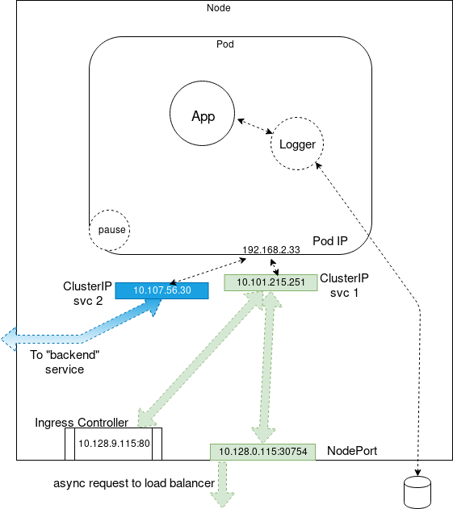

## Course Reading

### Learning objectives

- Explain a Kubernetes service
- Expose an application
- Discuss the types of services available
- Start a local proxy
- Use the cluster DNS


### Overview

Services are the agents connection Pods together or to allow access from outside the cluster. Typically via labels, and refreshed Pods are connected by the service so there is no change in the expected resources at a given Endpoint.

There are multiple types of services, each exposed internally or externally. Services also can be used to connect third party external resources, like a database, for example.

The kube-proxy operator watched the kube-apiserver for new services and endpoints. Random ports are opened listened on for traffic to the `ClusterIP:Port` and traffic is redirected to the randomly generated endpoint for the service. Services provide automatic load balancing, match label queries. This cannot be configured but there is possibility for session affinity via IP.  A headless service (without a fixed IP or load balancing) can be configured.

The unique IP addresses are configured via etcd, so Services implement iptables to route their traffic. Other technologies could be leveraged to provide access to resources later.


### Service update pattern

Labels on each Pod are used to determine what traffic should be received from a service. Labels can be dynamically updated on an object which can affect which Pods continue to connect to a service.

By default, the update pattern is to use a rolling deployment. New Pods are added with a new application version, and because of the automatic load balancing they will receive traffic along with the previous version of the application until the old version Pods are terminated.

If there would be an issue where routing traffic to a new and old version of an application during the update would cuase an issue, you may want to take the strategy where you use a more specific label for the new deployment, then turn down the old version, and update the labels to shift traffic to tie back to the original service.


### Accessing an application with a service

The basic steps for setting up access to a new service is as follows:

```bash
kubectl expose deployment/nginx --port=80 --type=NodePort
kubectl get svc
kubectl get svc nginx -o yaml
```

You could then hit the nginx server in your browser using the public IP and the port that was exposed with the service (you can find the public IP with a `kubectl get pods -o wide` or a `kubectl get endpoints`).

Now let's discuss what we actually did to expose the service, step by step. First we used the `kubectl expose` command to actually create the service.  This service used port 80 and chose a random port to use on the nodes.  You can pass a `port` (which we did) and `targetPort`. We also specified the type of service with the `--type=NodePort` option.

Next we ran a `kubectl get svc` to list all the services and find the one we just created. We see it was created with an internal IP. The range of available cluster IPs and the range of ports that can be used are configurable in the API server startup options.

Finally we ran `kubectl get svc nginx -o yaml` to view the manifest for the service in YAML format.


### Types of services

Behind the scenes, a service is an operator in the kube-controller-manager which sends API calls through the kube-apiserver to the network plugin and kube-proxy Pods running on the nodes. The service operator also creates endpoint operators to query the ephemeral IP addresses of Pods with a specific label. These operators work together to manage the firewall rules of the cluster via iptables or ipvs.

#### ClusterIP

This is the default service used. It only provides access internally (except when manually creating an external endpoint). The range of ClusterIPs is defined in API server startup options.

The `kubectl proxy` creates a local service to access a ClusterIP, which is helpful in troubleshooting and development scenarios.

#### NodePort

NodePorts are useful for debugging or when static IPs are necessary, like for opening a particular address access through a firewall.  The NodePort range is defined in the cluster configuration.

Some of these services build upon each other. A ClusterIP service configures a persistent IP and then directs traffic sent to that address to existing Pods ephemeral addresses, but only within the cluster.

When a NodePort service is created, first a ClusterIP is created first. Then a high numbered port is created and a firewall rule is sent out so that traffic to this new port on any node will be sent to the persistent IP, and then the Pods.

#### LoadBalancer

The LoadBalancer service was created so requests could be passed through cloud providers.  Private clouds may also implement this service with a cloud provider plugin like CloudStack or OpenStack.  Even without cloud providers, the address is made available for public traffic and packets are spread among Pods in the deployment automatically.

LoadBalancers do not create load balancers. Instead, a NodePort is created and makes async requests to use a load balancer. If a listener sees the request, like would occur when using a cloud provider, one would then be created. If no listener sees the request then the status remains _pending_ since no load balancer responds to the API call.

#### ExternalName

ExternalName is a newer service. It has no selectors, nor does it define ports or endpoints. It instead allows for an alias to be returned to an external service.  This redirect happens at the DNS level, not via proxy or forwarding. This type of service is useful for things not yet brought into the Kubernetes cluster. A simple future change will redirect traffic to the internal objects.

#### Ingress controllers

Ingress controllers are not services but instead a microservice running within a Pod. They listen on a high port on whichever node the pod is running on, and then sends traffic to service based on the requested URL. Ingress controllers are not built-in, but they are often used with services to centralize traffic. Ingress controllers will be discussed further later.


### Services diagram

Controllers for services and endpoints run in the kube-controller-manager, and send API calls through the kube-apiserver. The kube-apiserver then talks to the network plugin to direct the agents on each node what to do. Each kube-proxy is also sent an API call to manage the firewall locally, which is typically iptables or ipvs. The kube-proxy mode is configured via a flag, `mode`, set on initialization. The mode can be `iptables`, `IPVS`, or `userspace`.

In `iptables` mode, the API continually sends updates to the kube-proxy about changes to Services and Endpoints so rules can be updated as the objects are created, modified, and deleted.


### Overall network view




### Local proxy for development

When doing local development for an application, a quick way to check the service is to run a local proxy with `kubectl`. It captures the shell (unless places in the background). When running, calls can be made to the API via `localhost` and you can also reach the ClusterIP services via the API URLs.  The IP and port to listen on is configurable via command arguments.  To run a proxy:

```bash
kubectl proxy
```

This starts a proxy on `localhost` and uses port `8001` by default.  Then to access a service, name `example`, we can use the URL `http://localhost8001/api/v1/namespaces/default/services/example`. If the service port has a name, you'd append `:<port name>` to the end of the URL.


### DNS

Since v1.13, CoreDNS has been the default DNS provided. CoreDNS allows for a large amount of flexibility. When a container starts, it runs a server for the zones it is configured to serve, then each server loads one or many plugin chains to provide additional functionality. Like other microservices, clients access it using a service, kube-dns.

The in=tree plugins provide most additional common functionality. It is a fairly easy process to write and enable other plugins for extended functionality.

Common plugins are used to provide metrics to Prometheus, for error logging, health checking of the application, among other things.


### Verifying DNS registration

To verify DNS setup and check services are being registered, the easiest way is to run a pod with a shell and networking tools, create a service, and then exec in to do DNS lookups.

Troubleshooting DNS in the cluster uses typical tools like nslookup, dig, nc, wireshark, etc.  The difference though is we are leveraging a service to access the DNS server, so we need to check labels and selectors in addition to standard network debugging.

Other steps, like checking the Network Policies and firewalls can also be done. These will be covered more in a later chapter.


## Lab Exercises

### Lab 9.1 - Deploy a new Service

Services are Kubernetes objects which define policies to access logical sets of Pods. They are typically assigned `labels` so that there is persistent access, even when front or back end containers are terminated and replaced.

Native applications can use the `Endpoint` API for access but non-native apps can use a virtual IP-based bridge to access the Pods. These use a ServiceType which could be one of the following:
- ClusterIP - default and only exposes a cluster internal IP, so external access is prevented.
- NodePort - exposes a node IP on a static port. A ClusterIP is created in the background.