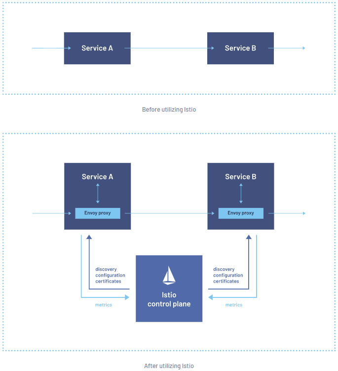

## Course Reading

### Learning objectives

- Discuss differences between an Ingress Controller vs a Service
- Learn about nginx and GCE Ingress Controllers
- Deploy and Ingress Controller
- Configure an Ingress Rule


### Overview

Earlier we learned about services and how to use them to connect containerized application in Kubernetes to outside the cluster. We can also used Ingress Controllers and Rules to do the same thing.

The difference between a service and ingress controllers lie in the efficiency.  Instead of many services, like `LoadBalancers`, traffic can be routed based on the host or the path.  This lets us centralize traffic that could be going to many services to a single point.

Ingress controllers are different from other controllers as they are not managed by the `kube-controller-manager`.  Multiple controller can be deployed with each using unique configuration.  A controller will use Ingress Rules to handle any traffic to and from outside the cluster.

There are many options for ingress controllers.  Some of them include GKE, nginx, Traefik, Contour, and Envoy.  Any tool that can be used as a reverse proxy should be able to work as an ingress controller, these agents will just need to consume rules and listen for the associated traffic. An Ingress Rule is an API object that we can create with `kubectl`.  When the rule is created, it updates the ingress controller to allow traffic to from the outside to the internal service. Services can be left as ClusterIPs and then we can define how traffic gets routed to them via ingress rules.


### Ingress controller

An ingress controller is a daemon running in a pod that watches the `/ingresses` endpoint of the API server.  They are part of the `networking.k8s.io/v1` group.  When new endpoints are created, the daemon uses the configured rules to allow the inbound traffic to the desired service, which is most often over HTTP.

You can deploy multiple ingress controllers. In that case, traffic should use annotations to select the correct controller to use.  A lack of matching annotations will cause every controller to try to satisfy the ingress traffic.


### nginx

Deploying nginx controllers is made simple through provided YAML files which can be found in the [Kubernetes Github](https://github.com/kubernetes/ingress-nginx/blob/main/docs/deploy/index.md)

Here you will also find configuration for several different platforms you can run a Kubernetes cluster on.

Like any ingress controller, there is come configuration required to deploy it properly. The deployment can be customized via configMaps, Annotations, or a custom template for more detailed use cases.

- Easy integration with RBAC
- Uses annotation `kubernetes.io/ingress.class: "nginx"`
- L7 traffic will require `proxy-real-ip-cidr` setting
- Bypasses kube-proxy for session affinity
- Does not use `conntrack` entries for iptables DNAT
- TLS requires host field to be defined


### Ingress API resources

A typical Ingress object looks like the this:

```yaml
apiVersion: networking.k8s.io/v1
kind: Ingress
metadata:
  name: ghost
spec:
  rules:
  - host: ghost.192.168.99.100.nip.io
    http:
      paths:
      - backend:
          service:
            name: ghost
            port:
              number: 2368
        path: /
        pathType: ImplementationSpecific
```

Like all object, you can manage Ingress objects with `kubectl`.

```bash
kubectl get ingress
kubectl delete ingress <ingress name>
kubectl edit ingress <ingress name>
```


### Deploying the ingress controller

Deploying an ingress controller is as simple as running a `kubectl apply` command.  You can find the source for a sample ingress from the link in the [nginx section](#nginx). You could also install the ingress controller via Helm by following the sample's guide.

You can check all that was deployed with the sample by running `kubectl get pods,rc,svc` to see what was deployed.


### Creating an ingress rule

Creating an ingress rule is fairly simple.  First let's assume we have a running pod and service.

```bash
kubectl run ghost --image=ghost
kubectl expose deployments ghost --port=2368
```

Now you could apply the ingress rules we defined with the example in [Ingress API resources](#ingress-api-resources)section. Once the ingress is created, the you should be able to access the application external to the cluster.


### Multiple ingress rules

If you have multiple services, you could also define multiple rules in the ingress definition. To do this you would just add to the list defined under the `rules` section of the manifest.


### Intelligent connected proxies

If you want to do things like service discovery, rate limiting, traffic management, or advanced metrics, you will likely need to implement a service mesh.  A service mesh consists of edge and embedded proxies that talk to each another to handle traffic based on rules from a control plane.

There are many options for service meshes, with some of the most popular being Envoy, Istio, and linkerd.

|  |
|:--:|
| <b>Example of a service mesh from Istio</b>|


- __Envoy__ - a modular and extensible proxy. It is popular due to the open construction, modularity, and it's dedication to remain unmonetized. It is common to use Envoy for as a data plane under near other tools in a service mesh.
- __Istio__ - a set of tools that leverages Envoy's proxies to construct a multi-component control plane.  It is intended to be platform independent.
- __linkerd__ - service mesh built for ease and speed of deployment and for being ultralight.


## Lab Exercises

### Lab 11.1 - Service mesh

First we will install linkerd.  Make sure all the installation steps are successful by reviewing the output of each command.

```bash
curl -sL run.linkerd.io/install | sh
export PATH=$PATH:/home/ubuntu/.linkerd2/bin
echo "export PATH=$PATH:/home/ubuntu/.linkerd2/bin" >> $HOME/.bashrc
linkerd check --pre
linkerd install --crds | kubectl apply -f -
linkerd install --set proxyInit.runAsRoot=true | kubectl apply -f -
linkerd check
linkerd viz install | kubectl apply -f -
linkerd viz check
linkerd viz dashboard &
```

The GUI for linkerd is enabled on localhost by default. We need to edit the `web` deployment and service to allow for access of the GUI outside the cluster since we are running in a cloud provider.

For the deployment, in the container args, find the `enforce-host` line and remove the value after the `=`.

On the service, add the `nodePort` to the `http` port with some high valued port number that is easy to remember and set the service `type` to a `NodePort`.

```bash
kubectl -n linkerd-viz edit deploy web
kubectl -n linkerd-viz edit svc web
```

Test access to your public IP.

```bash
curl ifconfig.io
```

Now use the public IP and the NodePort number you set to access the GUI in a browser on your local machine.

With the GUI accessible externally we can now add the annotations we need for linkerd to watch those objects. linkerd can do this for us by piping `kubectl` commands to `linkerd` and then back to `kubectl`. You should see an error about the creation of the object but it should work fine. The view the GUI again and you should see the `accounting` namespaces are meshed.

However, let's first create a deployment and expose it with a service to use in the service mesh.

```bash
kubectl -n accounting create deploy nginx --image=nginx
kubectl -n accounting expose deployment nginx --type=ClusterIP --port=80
```

Then we will inject the annotations.

```bash
kubectl -n accounting get deploy nginx -o yaml | linkerd inject - | kubectl apply -f -
```

Then we will want to generate some traffic to pods and watch that traffic in the UI. We'll use the `nginx` service we just created.

```bash
kubectl -n accounting get svc
curl <nginx ClusterIP>
```

In the UI you should see some HTTP metrics in the accounting namespace. Now let's scale up the `nginx` deployment to 5 replicas and then generate traffic to them.

```bash
kubectl -n accounting scale deploy nginx --replicas=5
curl <nginx ClusterIP>
curl <nginx ClusterIP>
curl <nginx ClusterIP>
curl <nginx ClusterIP>
curl <nginx ClusterIP>
curl <nginx ClusterIP>
```

In the UI we should see 5 replicas being meshed in the namespace as well as some other statistics.


### Lab 11.2 - Ingress controller

Bow we will use Helm to install an ingress controller.

First, we will want to create two deployments, one called `web-one` running httpd, and another called `web-two` running nginx.

```bash
kubectl create deployment web-one --image=httpd
kubectl create deployment web-tow --image=nginx
kubectl expose deployment web-one --type=ClusterIP --port=80
kubectl expose deployment web-two --type=ClusterIP --port=80
```

Linkerd does not have a bundled ingress controller ao we need to install on the cluster ourselves to manage traffic. We will use a Helm chart to do this. Let's search for `ingress` with Helm and then install the popular nginx ingress controller.

```bash
helm search hub ingress
helm repo add ingress-nginx http://kubernetes.github.io/ingress-nginx
helm repo update
```

Now we will download the chart, and update the `values.yaml` so that the ingress controller uses a DaemonSet instead of a Deployment by changing the `kind` field.

```bash
helm fetch ingress-nginx/ingress-nginx --untar
cd ingress-nginx
vim values.yaml
```

Then, we will install the controller. Then watch for the service to come up.

```bash
helm install myingress .
cd ..
kubectl get ingress --all-namespaces -w
kubectl get services -o wide myingress-ingress-nginx-controller
kubectl get pod --all-namespaces | grep nginx
```

Once the ingress controller is up and running, we can set up the ingress rules.

```bash
vim ingress.yaml
```

```yaml
apiVersion: networking.k8s.io/v1
kind: Ingress
metadata:
  name: ingress-test
  annotations:
    kubernetes.io/ingress.class: nginx
  namespace: default
spec:
  rules:
  - host: www.external.com
    http:
      paths:
      - backend:
          service:
            name: web-one
            port:
              number: 80
        path: /
        pathType: ImplementationSpecific
status:
  loadBalancer: {}
```

And now with the ingress rule defined, we can create it and verify it is working.

```bash
kubectl create -f ingress.yaml
kubectl get ingress
kubectl get pod -o wide | grep myingress
curl <Pod IP>
```

At this point you should see you got a 404 error response from your curl.  Now let's check the service (don't use the admission controller that you will see).

```bash
kubectl get svc | grep ingress
curl <myingress-ingress-nginx-controller service IP>
```

Again you should see that you are getting a 404 error. Let's try it again, this time passing a header matching the URL to one of the services we created earlier.  If it works you should see a default nginx/httpd server page.

```bash
curl -H "Host: www.external.com" http://<myingress-ingress-nginx-controller service IP>
```

With that working we can then add the annotations for linkerd. Again, you will see some warnings but it should work.

```bash
kubectl get ds myingress-ingress-nginx-controller -o yaml | linkerd inject --ingress - | kubectl apply -f -
```